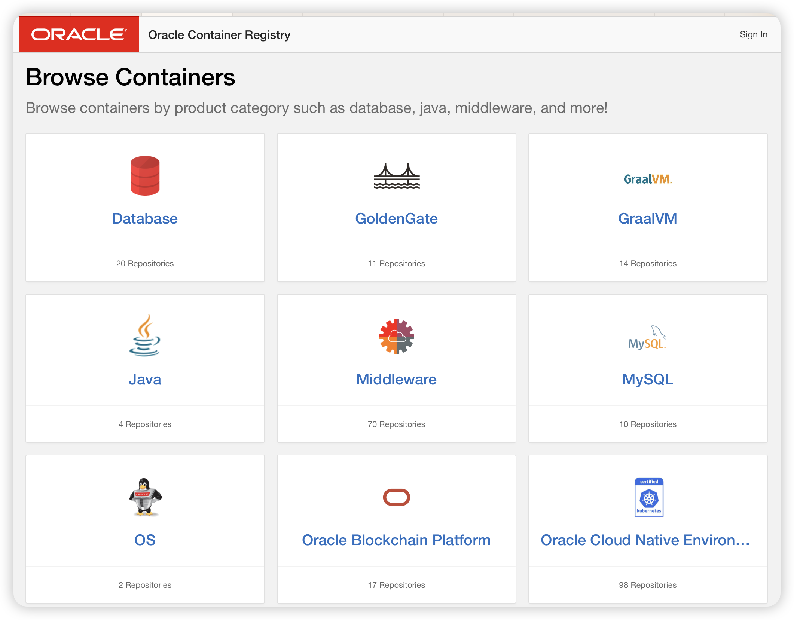
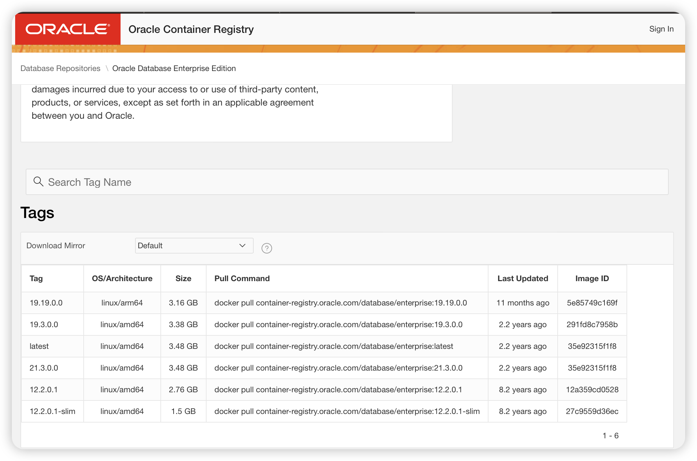

# oracle版本介绍

Oracle 在官方站点中列出了所有支持的产品，以及对应的仓库列表。 Oracle 镜像仓库的官方页面：
仓库官方页： https://container-registry.oracle.com/



数据库产品分为商业和开源版，商业版也是可以正常下载的，但是不能用于商业用途，下载的时候也要先登录oracle账号并同意协议。

商业版的数据库有如下版本：

| Repository                                                   | Description                                                  |
| ------------------------------------------------------------ | ------------------------------------------------------------ |
| [cman](https://container-registry.oracle.com/ords/f?p=113:4:117573001023866:::4:P4_REPOSITORY,AI_REPOSITORY,AI_REPOSITORY_NAME,P4_REPOSITORY_NAME,P4_EULA_ID,P4_BUSINESS_AREA_ID:1983,1983,Oracle Connection Manager,Oracle Connection Manager,1,0&cs=3kl8Z3Dg2rWMfThJnwZsEIbhi_gBuiWaEXal06W2AQcmEQLs13ztMjWZRb24ikNIoD0sOyPLEa7k7if9nC_bzDA) | Oracle Connection Manager                                    |
| [enterprise](https://container-registry.oracle.com/ords/f?p=113:4:117573001023866:::4:P4_REPOSITORY,AI_REPOSITORY,AI_REPOSITORY_NAME,P4_REPOSITORY_NAME,P4_EULA_ID,P4_BUSINESS_AREA_ID:9,9,Oracle Database Enterprise Edition,Oracle Database Enterprise Edition,1,0&cs=3Ec-IbDeSzVeJQAsiWqKIxZxJh5FMawteF5IZSH-Dfl6ouK0SpLIlXbT1Ca0V2djemKSPBRhso1GPa3e8uoZV9A) | Oracle Database Enterprise Edition                           |
| [graph-quickstart](https://container-registry.oracle.com/ords/f?p=113:4:117573001023866:::4:P4_REPOSITORY,AI_REPOSITORY,AI_REPOSITORY_NAME,P4_REPOSITORY_NAME,P4_EULA_ID,P4_BUSINESS_AREA_ID:2927,2927,Get started with the Property Graph feature of Oracle AI Database 26ai,Get started with the Property Graph feature of Oracle AI Database 26ai,1,0&cs=3R4Qhb1efSzTQicxzZCv-y0CooZzxKMOkceSckb4YUIcY5r6ycEK_lv_cV2dJ54G73lCQrlLXEzAU1_hKyzPpuw) | Get started with the Property Graph feature of Oracle AI Database 26ai |
| [gsm](https://container-registry.oracle.com/ords/f?p=113:4:117573001023866:::4:P4_REPOSITORY,AI_REPOSITORY,AI_REPOSITORY_NAME,P4_REPOSITORY_NAME,P4_EULA_ID,P4_BUSINESS_AREA_ID:763,763,Oracle Global Service Manager,Oracle Global Service Manager,1,0&cs=3dpFr5byFD5dnKYD1cAjuNw2m-SBKvp4aaM1efCOhjmWl992JkKxdRa2UczN_kIWqMMYzxxWHqorK-ADllbEaGQ) | Oracle Global Service Manager                                |
| [instantclient](https://container-registry.oracle.com/ords/f?p=113:4:117573001023866:::4:P4_REPOSITORY,AI_REPOSITORY,AI_REPOSITORY_NAME,P4_REPOSITORY_NAME,P4_EULA_ID,P4_BUSINESS_AREA_ID:61,61,Oracle Instant Client,Oracle Instant Client,1,0&cs=30DyV93u_9biQtMcJbZvWmw2Cx4fBskEU0oHnc38hBNWYku6aknPtCpNGuAwN0dM_iIVculMeMolArgTJScC7Fw) | Oracle Instant Client                                        |
| [microtx-ee-console](https://container-registry.oracle.com/ords/f?p=113:4:117573001023866:::4:P4_REPOSITORY,AI_REPOSITORY,AI_REPOSITORY_NAME,P4_REPOSITORY_NAME,P4_EULA_ID,P4_BUSINESS_AREA_ID:2363,2363,Oracle Transaction Manager for Microservices(MicroTx) Console,Oracle Transaction Manager for Microservices(MicroTx) Console,1,0&cs=3z1J9_kbXBd3ztqoa8vxhEHSm0fqTw90FwClB9TkZY9v4VlIul1JDj8g-bTRZsZVit_7RgPMKn8vPkDz3P6ExRw) | Oracle Transaction Manager for Microservices(MicroTx) Console |
| [microtx-ee-coordinator](https://container-registry.oracle.com/ords/f?p=113:4:117573001023866:::4:P4_REPOSITORY,AI_REPOSITORY,AI_REPOSITORY_NAME,P4_REPOSITORY_NAME,P4_EULA_ID,P4_BUSINESS_AREA_ID:2364,2364,Oracle Transaction Manager for Microservices (MicroTx) Enterprise Edition,Oracle Transaction Manager for Microservices (MicroTx) Enterprise Edition,1,0&cs=30Q7cPtcd2y1HjBuQZWjydscPUXysDzIvCAfcNJ8_ntcOXIlTieRZNfEXsFLsENEu-3UpBXod269wIHTK9PosRA) | Oracle Transaction Manager for Microservices (MicroTx) Enterprise Edition |
| [rac](https://container-registry.oracle.com/ords/f?p=113:4:117573001023866:::4:P4_REPOSITORY,AI_REPOSITORY,AI_REPOSITORY_NAME,P4_REPOSITORY_NAME,P4_EULA_ID,P4_BUSINESS_AREA_ID:392,392,Oracle Real Application Clusters,Oracle Real Application Clusters,1,0&cs=3tIxxLLYjAKiQaKyflCX2gtYHeTQsveBGEngBC558MJwF6fekRMe_MEhivpYEeQuyCC7hHuO1_n83d-Stwxu6dQ) | Oracle Real Application Clusters                             |

开源免费版本为

- express版：只支持到oracle18
- free版：支持oracle19之后的数据库

| Repository                                                   | Description                                                  | Open Source License Text                                     |
| ------------------------------------------------------------ | ------------------------------------------------------------ | ------------------------------------------------------------ |
| adb-free                                                     | Oracle Autonomous Database Free                              | The container image you have selected and all of the software that it contains is licensed under [Oracle Free Use Terms and Conditions](https://www.oracle.com/downloads/licenses/oracle-free-license.html) that are provided in the container image. Your use of the container is subject to the terms of those licenses. |
| expree                                                       | Oracle Database Express Edition                              | The container image you have selected and all of the software that it contains is licensed under [Oracle Free Use Terms and Conditions](https://www.oracle.com/downloads/licenses/oracle-free-license.html) that are provided in the container image. Your use of the container is subject to the terms of those licenses. |
| free                                                         | Oracle Database Free                                         | The container image you have selected and all of the software that it contains is licensed under [Oracle Free Use Terms and Conditions](https://www.oracle.com/downloads/licenses/oracle-free-license.html) that are provided in the container image. Your use of the container is subject to the terms of those licenses. |
| [observability-exporter](https://container-registry.oracle.com/ords/f?p=113:4:117573001023866:::4:P4_REPOSITORY,AI_REPOSITORY,AI_REPOSITORY_NAME,P4_REPOSITORY_NAME,P4_EULA_ID,P4_BUSINESS_AREA_ID:1611,1611,Oracle Database Observability Exporter (Metrics, Logs, and Tracing),Oracle Database Observability Exporter (Metrics, Logs, and Tracing),1,0&cs=3pGVSWcTdL6gdV2ZIBF5eFflSftCvP0Q745USm0UyIVMdjnxDrLR7safNBdZQXN0cArEaWcpvSNWT1jBEDZ2IjQ) | Oracle Database Observability Exporter (Metrics, Logs, and Tracing) | The container image you have selected and all of the software that it contains is licensed under UPL that are provided in the container image. Your use of the container is subject to the terms of those licenses. |
| [operator](https://container-registry.oracle.com/ords/f?p=113:4:117573001023866:::4:P4_REPOSITORY,AI_REPOSITORY,AI_REPOSITORY_NAME,P4_REPOSITORY_NAME,P4_EULA_ID,P4_BUSINESS_AREA_ID:1283,1283,This image is part of and for use with the Oracle Database Operator for Kubernetes,This image is part of and for use with the Oracle Database Operator for Kubernetes,1,0&cs=3AMgN0HsjC9M39HLzR9sAGIowbKVsDHkOYtvA1ztm88-Z3xvdkrSUXcS0TeZh2BjpTEadQ-5frbO3fSfTe54w5w) | This image is part of and for use with the Oracle Database Operator for Kubernetes | The container image you have selected and all of the software that it contains is licensed under UPL that are provided in the container image. Your use of the container is subject to the terms of those licenses. |
| [ords](https://container-registry.oracle.com/ords/f?p=113:4:117573001023866:::4:P4_REPOSITORY,AI_REPOSITORY,AI_REPOSITORY_NAME,P4_REPOSITORY_NAME,P4_EULA_ID,P4_BUSINESS_AREA_ID:1183,1183,Oracle REST Data Services (ORDS) command line interface.,Oracle REST Data Services (ORDS) command line interface.,1,0&cs=3tNbkM-bvOnN9Ye33Xne1hlmV_WgU1GtGz5d6uUPsut3m5E0FHeYbn_A3pu-0VH6qv6NEUvNZLd27MWCb4uLotQ) | Oracle REST Data Services (ORDS) command line interface.     | The container image you have selected and all of the software that it contains is licensed under [Oracle Free Use Terms and Conditions](https://www.oracle.com/downloads/licenses/oracle-free-license.html) that are provided in the container image. Your use of the container is subject to the terms of those licenses. |
| [ords-developer](https://container-registry.oracle.com/ords/f?p=113:4:117573001023866:::4:P4_REPOSITORY,AI_REPOSITORY,AI_REPOSITORY_NAME,P4_REPOSITORY_NAME,P4_EULA_ID,P4_BUSINESS_AREA_ID:2483,2483,Oracle REST Data Services (ORDS) Developer,Oracle REST Data Services (ORDS) Developer,1,0&cs=3ZllhaSW-UC5iHP41QuPpQsXolHof4Hnxvioq81muvrd56-V1Girr2ndPNTsI1MSZPg5vUcLjRje7b1Yq4rVrjw) | Oracle REST Data Services (ORDS) Developer                   | The container image you have selected and all of the software that it contains is licensed under [Oracle Free Use Terms and Conditions](https://www.oracle.com/downloads/licenses/oracle-free-license.html) that are provided in the container image. Your use of the container is subject to the terms of those licenses. |
| [otmm](https://container-registry.oracle.com/ords/f?p=113:4:117573001023866:::4:P4_REPOSITORY,AI_REPOSITORY,AI_REPOSITORY_NAME,P4_REPOSITORY_NAME,P4_EULA_ID,P4_BUSINESS_AREA_ID:1663,1663,Oracle Transaction Manager for Microservices (MicroTx) Free,Oracle Transaction Manager for Microservices (MicroTx) Free,1,0&cs=3tfQJS_Jaghe7p_he0QTxuARrCbRz205v2tt_5sNDMPNH7mLKzmdgGYBPp6a1pHKsmDTwFE5tl4ZngNLIbFCvxw) | Oracle Transaction Manager for Microservices (MicroTx) Free  | The container image you have selected and all of the software that it contains is licensed under [Oracle Free Use Terms and Conditions](https://www.oracle.com/downloads/licenses/oracle-free-license.html) that are provided in the container image. Your use of the container is subject to the terms of those licenses. |
| [sqlcl](https://container-registry.oracle.com/ords/f?p=113:4:117573001023866:::4:P4_REPOSITORY,AI_REPOSITORY,AI_REPOSITORY_NAME,P4_REPOSITORY_NAME,P4_EULA_ID,P4_BUSINESS_AREA_ID:1184,1184,Oracle SQL Command Line (SQLcl),Oracle SQL Command Line (SQLcl),1,0&cs=3FcNZOFnvm08a7M3n7DDAUmzUzeKqIadWnp2M0lqzhmc_BVSXGZx1SJKrYFfaGtA819nLIerLVbp1GuZZ-X09FQ) | Oracle SQL Command Line (SQLcl)                              | The container image you have selected and all of the software that it contains is licensed under [Oracle Free Use Terms and Conditions](https://www.oracle.com/downloads/licenses/oracle-free-license.html) that are provided in the container image. Your use of the container is subject to the terms of those licenses. |

# oracle官方镜像拉取

以oralce enterprise版本为例，介绍下载安装过程。

1. 注册oracle账号并生成auth token
2. 在仓库官方页选择要

## 生成auth token

To pull licensed software from the Oracle Container Registry, generate an authentication token and use it as the `password` value when using the `podman login` command.

**caution**

From 2025-06-30 onward, authentication tokens are the only accepted credential type when authenticating Podman with the Oracle Container Registry.

1. Sign in to the Oracle Container Registry. 

   In a web browser, sign in to the Oracle Container Registry using an Oracle account at [https://container-registry.oracle.com](https://container-registry.oracle.com/). 

2. Select the profile name. 

   Select the profile name, and in the profile menu that appears select **Auth Token**.

3. Generate the Secret Key. 

   Select **Generate Secret Key** and note down the secret key. This is only displayed once, during the initial generation.

4. (Optional) Regenerate the Secret Key. 

   If you lose or forget the secret key, generate a new one by selecting **Delete Secret Key**, then select **Generate Secret Key** again.

## 选择要下载的版本

在oracle容器仓库中选择要下载的版本号。



## 登录oracle并下载镜像

由于oracle企业版是需要认证的，因此在拉取镜像前，需要先登录oracle账号。

``` bash
docker login container-registry.oracle.com
```

输入命令后根据提示输入用户名和密码，值得注意的是密码并不是注册oracle官网账号时的密码，而是上一步生成的auth token。


登录成功后，使用`dcoker pull`命令就可以拉取镜像了，以`Oracle19.3.0.0`为例，其命令为：

``` bash
docker pull
container-registry.oracle.com/database/enterprise:19.3.0.0
```


# Ref

1. https://docs.oracle.com/en/operating-systems/oracle-linux/podman/registries.html#registry_list
2. https://pkaq.org/2021/05/07/oracle12c/