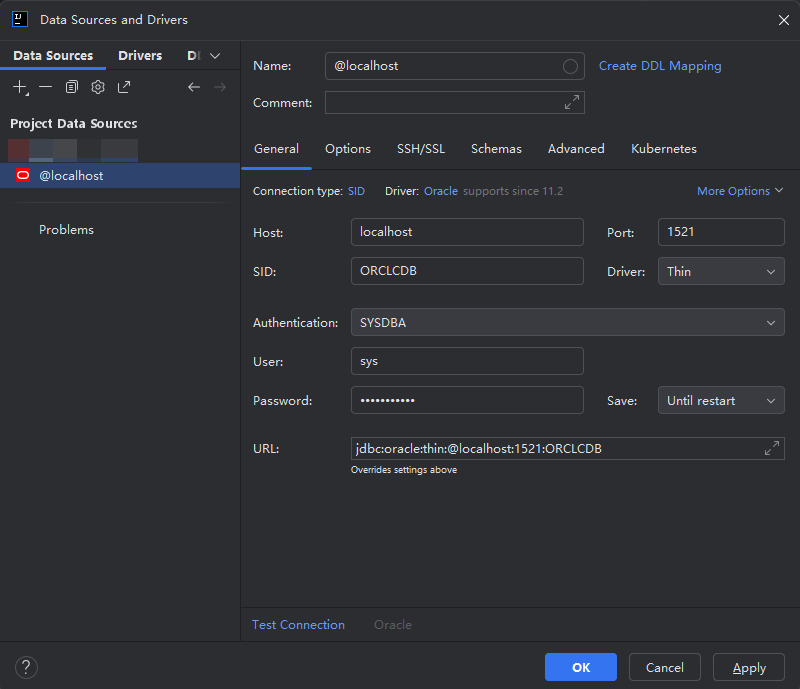

可以通过如下命令启动`oracle`的`docker`容器。

``` bash
sudo docker run -d \
	--name oracle \
    -p 1521:1521 \
    -p 5500:5500\
    -e ORACLE_SID=ORCLCDB\
    -e ORACLE_PDB=ORCLPDB1\
    -e ORACLE_PWD=Password123\
    -e ORACLE_CHARACTERSET=AL32UTF8\
    container-registry.oracle.com/database/enterprise:19.3.0.0
```

下面对参数进行说明

参数|含义
-|-
`oracle_sid`|`SID`是一个数据库的唯一标识符。通常中是环境变量：`ORACLE_SID`。每个`Oracle`数据库实例都有一个唯一的`SID`，它用于在操作系统层面标识和区分不同的`Oracle`实例。通常用`JDBC`连接数据库时指定的`SID`即为此值。
`oracle_cdb`|容器数据库，是整个实例的“壳”。用于实现实例和数据库的一对多关系。
`oracle_pdb`|`Pluggable Database`，即可插拔数据库，可以实现从一个`CDB`拔出，插入到另一个`CDB`中。`pdb`是真正用于存放表，用户和应用数据的地方。
`oracle_pwd`|用于设置`sys`用户的密码


# 使用idea连接


