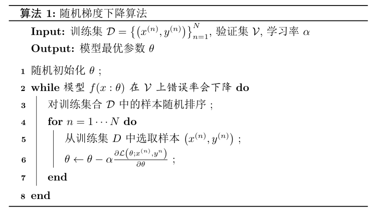

机器学习：让计算机从数据中进行自动学习，得到某种知识(规律).机器学习任务总体上包括**特征学习/特征表示**和**浅层学习**两部分
- 特征学习:从原始输入中提取输入的特征,从而将原始的图像/音频/文字输入转化成特征向量.
- 浅层学习:建立特征向量与输入标签之间的映射关系.

# 机器学习的基本概念

## 机器学习任务的分类
基本的机器学习任务:

| 类别       | 例子                | 特点                                                                                 |
| ---------- | ------------------- | ------------------------------------------------------------------------------------ |
| 监督学习   | 分类                | 输出是一个离散的值                                                                   |
|            | 回归                | 输出是一种连续的值                                                                   |
| 无监督学习 | 聚类:一种无监督学习 |
|            | 降维                |
|            | 密度估计            | 给定一些点,估计该空间中点的概率                                                      |
| 强化学习   |                     | 通过与环境交互来学习,围棋每下完一盘棋可以判定最终的输赢,不断试错,使得预期收益最大化. |

## 基本概念
- 样本：一个标记好特征的（**特征向量**）以及**标签**的（离散表示或分布式表示）的实例才可以称为一个**样本**。要求：标记好特征向量，有标签
  - 特征向量：一个D维的向量$x=[x_1,x_2,...,x_D]^T$可以用来表示一个实例所有特征构成的向量。每一维就代表一个特征。
  - 标签：通常使用标量y来表示。
- 数据集：一组样本的集合，一般来说数据集包括**训练集**和**测试集**
- 学习/训练：找到一个最优的函数$\hat{y}=f^*(x)$或$\hat{p}(y|x)=f^*_y(x)$来近似每个样本的**特征向量x**和**标签y**之间的真实映射关系的过程。

- 准确率:$\displaystyle Acc \left (f^*(x) \right )=\frac{1}{D'}\sum_{(x,y)\in D'}I(f^*(x)=y)$
  - $I(.)$:指示函数，true时输出1，false时输出0
  - $|D'|$：测试集的大小

# 机器学习三要素
三要素为：模型，学习准则，优化算法

| 要素     | 作用                                                                                                    |
| -------- | ------------------------------------------------------------------------------------------------------- |
| 模型     | 确定函数的基本类型,如函数是使用一次函数,二次函数,指数函数,幂函数或是对数函数等.                         |
| 学习准则 | 是一个标准,用于衡量一个模型是否优秀,是否与真实的映射函数相近.                                           |
| 优化算法 | 模型和学习准则确定好之后就需要确定模型学习准则最佳时,模型的具体的参数,这个求解的过程就是一个最优化问题. |
## 模型
### 线性模型
线性模型可看成一个**参数化**的**线性函数族**:
$f(x:\theta)=w^Tx+b$

其中参数$\theta$包括权重$w^T$和偏置值$b$.权重$w^T$是一个列向量,偏置值$b$是一个实数.

### 非线性模型

广义的非线性模型可以写成多个**非线性基函数**$\phi(x)$的组合.
$$
\begin{split}
f(x:\theta)&=w^T\phi(x)+b \\
\phi(x)&=[\phi_1(x),\phi_2(2),...,\phi_K(x)]^T
\end{split}
$$

- $f(x:\theta)$:为K个**非线性基函数**组成的向量。(基函数:构成函数空间的基本单位,基函数的线性组合可以逼近复杂函数,如多项式基函数(如泰勒展开式)可以逼近复杂函数)
- 参数$\theta$包含了权重向量$w$和偏置$b$。
- 如果$\phi(x)$本身为可以学习的基函数，如$\phi_k(x)=h(w^T_k\phi)$,则$f(x:\theta)$则等价与神经网络.(神经网络是一个非线性模型)

## 学习准则
好的模型应尽量与真实映射函数一致.
即模型的**期望风险/期望错误**$R(\theta)$应该尽可能小.

$$
R(\theta)=\mathbb{E}_{(x,y)\sim P_r(x,y)}[\mathcal{L}(y,f(x:\theta))]
\begin{cases}
  \mathbb{E}:&期望 \\
(x,y)\sim P_r(x,y):&(x,y)服从P_r(x,y)分布\\
\mathcal{L}(y,f(x:\theta)):&模型预测值与真实值的损失值 \\
\mathcal{L}:&损失函数
\end{cases}
$$

**学习准则**:衡量模型与真实映射函数间的一致性.由于期望风险是不可计算的,所以根据**大数定律**使用**经验风险(EmpiricalRisk)**来逼近**期望风险**.
$$
\mathcal{R_D^{emp}}(\theta)=\frac{1}{N}\sum_{n=1}^N\mathcal{L} \left (y^{(n)},f\left (x^{(n)}:\theta\right ) \right )
$$
### 损失函数
非负实数函数,用于量化模型预测和真实标签之间的差异.

#### 0-1损失函数

#### 平方损失函数
$\mathcal{L}(y,f(x:\theta))=\frac{1}{2}(y-f(x:\theta))^2$
#### 均方误差损失函数
$MSE=\frac{1}{n}\sum_i^n(\hat{y_i}-y_i)^2$

## 优化算法

**训练集**，**假设空间**以及**学习准则**确定后，如何找到最优模型$f(x:\theta^*)$就是一个**最优化问题**。机器学习的训练过程其实就是**最优化问题**的求解过程。

$$
\begin{split}
  &min R(\theta)=\mathbb{E}_{(x,y)\sim P_r(x,y)}[\mathcal{L}(y,f(x:\theta))]\\
  \substack{大数定律 \\ \Longrightarrow} & min \mathcal{R_D^{emp}}(\theta)=\frac{1}{N}\sum_{n=1}^N\mathcal{L}(y^{(n)},f(x^{(n)}:\theta))\\
  \substack{ (x,y) \in 训练集D\\ \Longrightarrow} &
  \substack{min\\ \theta} \mathcal{R_D^{emp}}(\theta)=\frac{1}{N}\sum_{n=1}^N\mathcal{L}(y^{(n)},f(x^{(n)}:\theta))
\end{split}
$$

由于训练集中所有的数据都是已知量,所以机器学习优化的对象就是未知的参数和超参数：
 | 待求解内容 | 求解方法                                                                                                                                                           |
 | ---------- | ------------------------------------------------------------------------------------------------------------------------------------------------------------------ |
 | $\theta$   | 是模型的参数,可以通过优化算法学习                                                                                                                                  |
 | 超参       | 此类参数用于**定义模型结构**和**优化策略**. 超参的选取一般都是**组合优化问题**,难以通过优化算法自动学习 **超参优化**是一个经验性很强的技术,通常根据经验设定. |
  
常见的超参有:聚类算法中的类别个数,梯度下降法中的步长、正则化项的系数、神经网络层数、支持向量机中的核函数等.

在数学中,要找到$f(x:\theta)$最优解,$f(x:\theta)$的类型不同,则可以使用的方法也不同.对于凸函数,其只有一个极值点,所以这个唯一的极值点就是最优解;对于非凸函数,其极值点不止有一个,因此需要找一个最佳的极值点.

| 优化问题类型 | 优化算法         |
| ------------ | ---------------- |
| 凸函数       | 极值点便是最优点 |
| 非凸函数     | 梯度下降法       |
|              | 提早停止         |
|              | 随机梯度下降法   |
|              | 小批量梯度下降法 |

### 最优化问题的数学基础
#### 一元函数导数与Taylor级数
一元函数导数几何意义为函数$f(x)$ 在$x_{0}$ 上的切线方向,其数学定义为:
$$
f'(x)=\lim_{x \rightarrow x_0} \frac{x_0}{x-x_0}
$$

$f(x)$ 在 $x_{0}$ 附近的 `Taylor` 级数是:
$$
f(x) = f(x_{0}) + f'(x_{0})(x-x_{0}) + \frac{f''(x_{0})}{2}(x-x_{0})^{2} + O(|x-x_{0}|^{3})
$$

一元函数中,判断一个极值点是否是局部最小值还是局部最大值的方法:
$$
\begin{cases}
  f'(x_{0}) = 0 \quad\&  \quad f''(x_{0})>0 \Rightarrow x为局部最小值\\
  f'(x_{0}) = 0 \quad\& \quad f''(x_{0})<0 \Rightarrow x为局部最大值
\end{cases}
$$

#### 多元函数导数
对于多元函数$f(\bold{x}) = f(x_{1},\cdots, x_{n})$ 而言，同样可以计算它们的“导数”，也就是偏导数.

多元函数的导数为:
$$
\nabla f(\bold{x}) = \bigg(\frac{\partial f}{\partial x_{1}}(\bold{x}), \cdots, \frac{\partial f}{\partial x_{n}}(\bold{x})\bigg)
$$

相应的多元函数 $f(\bold{x})$ 在点 $\bold{x}_{0}$ 上的 `Taylor` 级数是：
$$
 f(\bold{x}) = f(\bold{x}_{0}) + \nabla f(\bold{x}_{0})(\bold{x}-\bold{x}_{0}) + \frac{1}{2}(\bold{x}-\bold{x}_{0})^{T}H(\bold{x}-\bold{x}_{0}) + O(|\bold{x}-\bold{x}_{0}|^{3})
$$
其中 `H` 表示` Hessian` 矩阵。如果 $x_{0}$是临界点，并且 `Hessian` 矩阵是**正定矩阵**的时候， $f(\bold{x})$ 在 $x_{0}$ 处达到局部极小值。

### 梯度下降法
在数学中，梯度的方向就是函数增长速度最快的方向，梯度下降就是函数减少最快的方向。在一元函数中，某一点的梯度就是该点负向切线的方向。
$$
\begin{align*}
  \theta_{t+1} &= \theta_t - \alpha\frac{\partial \mathcal{R_D}(\theta)}{\partial(\theta)}\\
  &=\theta_t-\alpha\frac{1}{N}\sum_{n=1}^N\frac{\partial \mathcal{L} \left (y^{(n)},f(x^{n}:\theta) \right )}{\partial\theta}
\end{align*}
$$
其中参数$\alpha$也叫做**学习率(learning rate)**,这是一个非常重要的**超参数**.

<!-- TODO -->
#### 学习率过大的问题--震荡

<!-- TODO -->
#### 学习率过小的问题--局部最小值
学习的效率低,而且有可能陷入局部最小值的状态.

<!-- TODO -->
#### 自适应学习率
学习率动态变化,最开始时学习步长可以比较大,越靠近极值点学习率减小

### 随机梯度下降法
为梯度下降法的变种,梯度下降法要求每次迭代时都要使用全部的样本,二随机梯度下降法每次迭代只采集一个样本.当迭代足够多次数时,随机梯度下降也可以收敛到局部最优解.核心的迭代过程为:
$$
\theta_{t+1}=\theta_t - \alpha \frac{\partial \mathcal L \left ( y^{(n)},f(x^{(n)}:\theta) \right)}{\partial \theta} \quad n=1 \cdots N
$$

在实际使用随机梯度下降法时,要保证随机性,但是有可能有些样本选中多次,有些样本没有被选到,不能充分利用样本数据.因此实际的随机梯度下降法一般是:先对训练集中的样本随机排序,然后依次选择样本.

随机梯度下降的优缺点为:
| 优点                                                                                                                          | 缺点                                              |
| ----------------------------------------------------------------------------------------------------------------------------- | ------------------------------------------------- |
| 每次计算的开销比较小,不像每次迭代都需要计算所有的样本 支持在线学习,即如果每次送过来一个数据,如随机梯度下降可以及时处理  | 每次计算一个样本,无法充分利用计算机的并行计算能力 |

PS:
1. 为何每次计算一个样本也可以计算出局部最小值?

### 小批量(mini-batch)随机梯度下降

小批量每次选一小部分训练样本来计算梯度并更新参数,每次选取的样本数量叫做**batch size**.如果`batch size`过小,则训练的次数过多,收敛慢;如果`batch size`过大,则训练的样本过多,无法一次性读入内存.此外,较大的`batch size`也容易是的模型收敛在局部最优点.而使用`mini-batch` 相当于人为添加噪声,模型更容易走出局部最优解.
$$
显存占用 = 模型显存占用 + {batch\_size} \times 每个样本的显存占用
$$
而模型的参数$\theta$z主要包括偏置值和权重;梯度和动量也需要存储在显存中,而梯度占用的内存大小与$\theta$有关,参数有多少,那么对应的梯度就有多少.如果还要保存动量,那么就是$3 \times |\theta|$

目前`mini-batch`方法使用广泛.

### 泛化与正则化
泛化误差:期望风险与泛化风险的差值,即:
$$
\mathcal{G_D(f)}=\mathcal{R(f)}-\mathcal{R_D^{emp}(f)}
$$
当经验风险比较低,但是泛化误差比较大时为**过拟合**,而经验风险和泛化误差都比较高的时候就是欠拟合.欠拟合一般是由于模型复杂度较低,而过拟合则可能是模型过于复杂,数据量过少或存在噪声. 

因为模型过于复杂而导致的过拟合可以通过**正则化**来解决.(欠拟合时模型复杂度可能比较低,此时就不适合用正则化,用了欠拟合的程度更大)
正则化:所有损害优化的方法都是正则化.
- 增加优化约束
  - L1/L2正则化
  - 数据增强
- 干扰优化过程
  - 权重衰减
  - 随机梯度下降
  - 提前停止
# Reference
1. [深度学习中的优化算法](https://zhuanlan.zhihu.com/p/43506482)