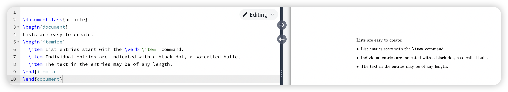
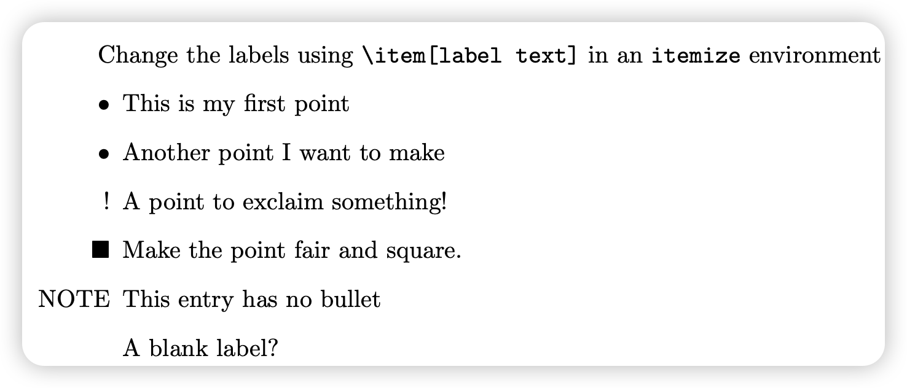
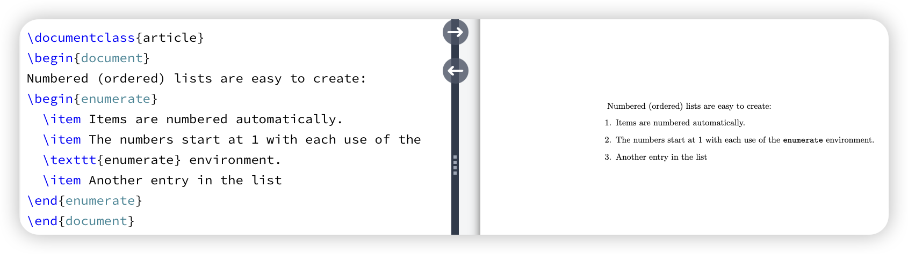
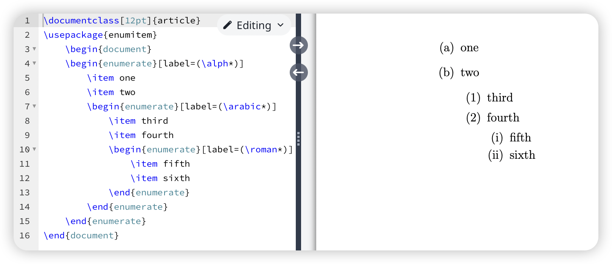
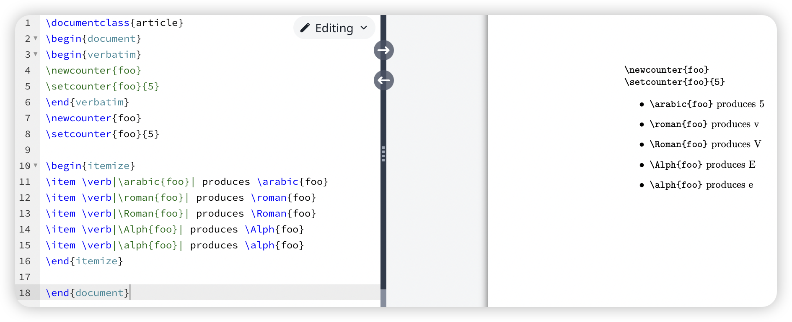

latex的基本用法

无序列表：使用`itemize`环境

有序列表：使用`enumrate`环境

# 内置基本列表

## 无序列表

### 基本创建方法

使用`itemize`  环境可以创建无序列表。

``` latex
\begin{itemize}
  \item List entries start with the \verb|\item| command.
  \item Individual entries are indicated with a black dot, a so-called bullet.
  \item The text in the entries may be of any length.
\end{itemize}
```

基本的用法为：

- 使用`itemize`创建无序列表环境
- 使用`\item`创建`List entry`,每条`entry`文本的长度可以是任意长度



### 列表样式设置

在`\item`中添加参数以设置列表的样式

``` latex
\item[label text] Text of your entry goes here..
```

可以在`\item`中使用数学符号作为编号，如`\item[$\blacksquare$]`。(数学环境符号需要使用`$$`引用)。

也可以自定义任何字符作为编号，如`\item[$\ANY character]`。

例如：

``` latex
Change the labels using \verb|\item[label text]| in an \texttt{itemize} environment
\begin{itemize}
  \item This is my first point
  \item Another point I want to make 
  \item[!] A point to exclaim something!
  \item[$\blacksquare$] Make the point fair and square.
  \item[NOTE] This entry has no bullet
  \item[] A blank label?
\end{itemize}
```

在`\item`中设置基本的编号的格式，效果为。



## 有序列表

### 基本环境创建

使用`enumerate`环境可以创建有序列表。

基本用法为：

- 使用`enumerate`创建有序列表环境
- 使用`\item`创建`ordered list entry`,`entry`长度不限

``` latex
\begin{document}
Numbered (ordered) lists are easy to create:
\begin{enumerate}
  \item Items are numbered automatically.
  \item The numbers start at 1 with each use of the \texttt{enumerate} environment.
  \item Another entry in the list
\end{enumerate}
```



### 样式更改

样式更改主要使用到`enumite`宏包，通过使用`enumite`宏包可以对有序列表的样式等进行更改，例如更改编号的格式，起始编号等。具体可以参考：

1. [Latex list教程–无涯教程](https://www.cnblogs.com/learnfk/p/15696624.html)
2. [overleaf-Lists](https://www.overleaf.com/learn/latex/Lists#The_description_environment)

#### 更改编号格式

在`enumerate`环境中定义`\label`标签可以设置编号的格式。

例如：

``` latex
\documentclass[12pt]{article}
\usepackage{enumitem}
\begin{document}
\begin{enumerate}[label=(\alph*)]
    \item one 
    \item two 
    \begin{enumerate}[label=(\arabic*)]
        \item third 
        \item fourth 
        \begin{enumerate}[label=(\roman*)]
            \item fifth 
            \item sixth 
        \end{enumerate}
    \end{enumerate}
\end{enumerate}
\end{document}
```

其对应的样式如下



`enumite`宏包常用的编号的格式为：

| 代码        | 说明                                   |
| ----------- | -------------------------------------- |
| **\Alph**   | 用于大写字母(A，B，C ...)              |
| **\alph**   | 用于小写字母(a，b，c，d...。)          |
| **\roman**  | 对于小写的罗马数字(i，ii，iii，iv ...) |
| **\Roman**  | 用于大写罗马数字(I，II，III，IV ...)   |
| **\arabic** | 用于阿拉伯数字(1、2、3、4、5 ...)      |

#### 设置列表跳过量

同时也可以使用`\setcounter`命令设置编号的跳过量。（该命令无需依赖`enumite`宏包）

例如：



其中`\verb||`命令的作用是直接引用，`latex`会将其看成文本而不会将其视为命令，因此不会执行，也不会转译。

## description

