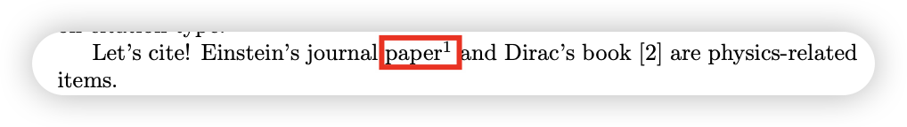
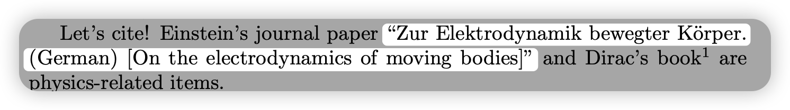

# Biblatex-参考文献管理

latex中有三种主要的参考文献管理包：

| 包       | 特点                                                         |
| -------- | ------------------------------------------------------------ |
| bibtex   | 最老，但是兼容性好                                           |
| natbib   | bibtex的补丁相当于，增强了bibtex的功能，可以调整参考文献的格式。但是还是不支持国际化 |
| biblatex | 现代化的引文管理系统，支持unicode编码                        |

## biblatex的引入和配置

biblatex可以看作是bibtex的增强版，或者说可以算是bibtex的超集。其与bibtex的基本功能相同，都是管理参考文献，不同之处在于其还可以进行一些参考文献的样式设置和排序规则设定，比bibtex更灵活些。

### Introduction

使用biblatex管理latex的参考文献基本的模版为：

``` latex
\documentclass[letterpaper,10pt]{article}
\usepackage{biblatex} %Imports biblatex package
\addbibresource{sample.bib} %Import the bibliography file

\begin{document}
Let's cite! Einstein's journal paper \cite{einstein} and Dirac's
book \cite{dirac} are physics-related items. 

\printbibliography %Prints bibliography

\end{document}
```

使用的基本逻辑为：

1. 通过\usepackage命令导入biblatex宏包
2. 使用\addbibresource命令制定.bib文件的路径
3. 使用\cite等命令进行引用
4. 通过\printbibliography命令在论文中打印参考文献，类似于\maketitle命令

### Basic Usage

在引入biblatex宏包时可以一并将一些参数穿过来。其中一个样例为：

``` latex
\usepackage[
backend=biber, % 指定编译时的处理工具
style=alphabetic,% 定义参考文献和引用的样式
sorting=ynt
]{biblatex}
```

#### biber

biber主要用于给参考文献排序，和bibtex的作用相同，bibtex更老，biber更新。由于biber是全部使用标准的latex宏定义，其不仅可以为引用的参考文献进行排序，还可以定义参考文献的样式。

#### 参考文献和引文的样式

对于常用的期刊或者会议论文，参考文献的样式就使用*numeric*就好。

| 样式       | 预览                                                     |
| ---------- | -------------------------------------------------------- |
| numeric    |  |
| alphabetic |  |

还有其他没见过怎么用的参考文献样式，参见[Biblatex bibliography styles](https://www.overleaf.com/learn/latex/Biblatex_bibliography_styles)

每一种bibliography style都有默认的citation style，使用默认的就好，当然也可以手动设置，关于citation style的说明参见[Biblatex citation styles](https://www.overleaf.com/learn/latex/Biblatex_citation_styles)

#### 参考文献排序规则

在引入biblatex包时定义参考文献的排序规则。通过`sorting`属性来定义，其可选的值有：

| 选项    | 排序方式                                                     | 适用场景                          |
| ------- | ------------------------------------------------------------ | --------------------------------- |
| `none`  | 按照 `\cite{}` 出现的顺序排序（引用顺序）                    | 适用于按正文引用顺序排序，如 IEEE |
| `nty`   | 先按作者姓名（n），再按年份（t），最后按标题（y）            | 适用于大多数学术论文              |
| `nyt`   | 先按作者姓名（n），再按标题（y），最后按年份（t）            | 适用于按标题排序的文献            |
| `nyvt`  | 先按作者姓名（n），再按年份（y），然后按卷号（v），最后按标题（t） | 适用于期刊引用较多的场景          |
| `anyt`  | 先按作者（a），再按编辑（n），再按年份（y），最后按标题（t） | 适用于包含大量书籍的文献          |
| `anyvt` | 先按作者（a），再按编辑（n），再按年份（y），然后按卷号（v），最后按标题（t） | 适用于期刊和书籍混合的场景        |
| `debug` | 生成详细的调试信息（用于检查排序规则）                       | 主要用于排查问题                  |

### Compile

- 使用xelatex进行编译，生成aux辅助文件，同时也会生成不带目录和参考文献的pdf
- 使用biber后端程序对aux进行编译，生成bbl文件
- 使用xelatex进行编译，生成完整的pdf文件

 这里给出vscode中使用biblatex的配置文件，具体可以参考：[Biblatex + VScode 使用指南（原理+配置+示例代码）](https://blog.csdn.net/qq_53937391/article/details/132957981)。

``` json
// latex-workshop的编译工具
"latex-workshop.latex.tools": [
    {
        "name": "XeLaTeXmk",
        "command": "latexmk",
        "args": [
            "-xelatex",
            "-output-directory=./tmp",
            "-synctex=1",
            "-shell-escape",
            "-interaction=nonstopmode",
            "-file-line-error",
            "%DOC%"
        ]
    },
],
// 配置biblatex recipes
"latex-workshop.latex.recipes": [
    {
        "name": "latexmk-xe",
        "tools": [
            "XeLaTeXmk"
        ]
    },
],
```


## 标注命令


### 基本标注命令

#### cite

``` latex	
% 标注命令
Let's cite! Einstein's journal paper \cite{einstein} and Dirac's book \cite{dirac} are physics-related items. 

% 标注样式
Let’s cite! Einstein’s journal paper [1] and Dirac’s book [2] are physics-
related items.
```

#### supercite

上标引用在基本的cite的基础上改变了标注的样式，将序号变成了上标。

``` latex
% supercite
Let's cite! Einstein's journal paper \supercite{einstein} and Dirac's book \cite{dirac} are physics-related items. 
```

预览效果为：



#### footcite

该命令用于添加脚注，但是脚注显示的信息和内容根据biblatex的样式参数不同而不同。

``` latex
Let's cite! Einstein's journal paper \supercite{einstein} and Dirac's book \footcite{dirac} are physics-related items. 
```

在`style=verbose`时，其预览效果为：


而在`style=numberic`时，其预览效果则是：


其脚注效果为：


### 与内容有关的标注命令

上面的主要是和标注的位置有关的命令，如上标，脚注之类的。这部分是与引文内容有关的命令。

#### citeauthor

使用`citeauthor`命令可以从bib文件中引用参考文献的作者信息。

``` latex
% citeauthor
Let's cite! \citeauthor{einstein}'s journal paper and Dirac's book \footcite{dirac} are physics-related items. 
```

预览效果为：


#### citetitle

使用`citetitle`命令引用参考文献的`title`

``` latex
Let's cite! \citeauthor{einstein}'s journal paper \citetitle{einstein} and Dirac's book \footcite{dirac} are physics-related items. 
```


预览效果为：


