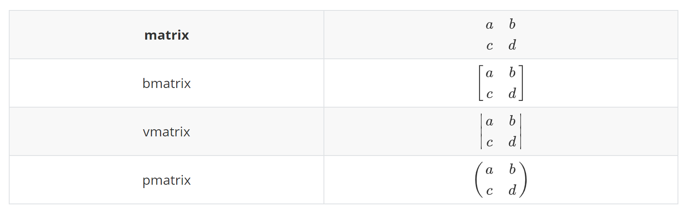

# 常见数学运算的表示方法
## 求和
行内公式和行间公式的显示方式不同,对于行间公式,公式的高度可以调整,但是对于行间公式,公式需和同一行内其他文字高度保持一致,因此对于求和等行高值比较大的符号行间公式会压缩.
### 行内公式高度压缩格式调整
如公式`\sum_{x=1}^{N}\frac{1}{x}`在行内模式下显示为$\sum_{x=1}^{N}\frac{1}{x}$.而在行间模式下其显示为:
$$
\sum_{x=1}^{N}\frac{1}{x}
$$
要想在行内的显示效果和行间的效果相同,则可以使用`\limits`命令将上下标分别放上求和符号的上面和下面.`\sum\limits_{x=1}^{N}\frac{1}{x}`,显示效果为:
$\sum\limits_{x=1}^{N}\frac{1}{x}$.但是这种方法还是以行内公式的样式来显示的.

也可以直接用`\displaystyle`命令来让行内公式呈现出行间公式的显示效果:$\displaystyle \sum_{x=1}^{N}\frac{1}{x}$

### 求和符号与算式距离过远的问题
$$
\sum_{=<quiteBigInteger}^N \frac{1}{x}
$$
在这个公式中,求和符号$\sum$与$\displaystyle \frac{1}{x}$隔得很远.看起来不是很好看,因此可以使用`mathtools`包中的`\smashoperator`命令.  (`mathtools`包主要用于美化数学公式的样式)
$$
\smashoperator{\sum_{x=quiteBigInteger}^N} \frac{1}{x}
$$
## 分式
| 命令                 | 宏包      | 特点                                              |
| -------------------- | --------- | ------------------------------------------------- |
| `\frac{分子}{分母}`  | 自带      | 在行内模式中,公式固定行高,因此会压缩字体大小      |
| `\Dfrac{分子}{分母}` | `amsmath` | 无论何种模式都不会压缩字体大小,分式高度会高于行高 |

``` latex
f(x)=\frac{1}{x} \quad f(x)=\dfrac{1}{x}
```
行内公式:$frac命令:
f(x)=\frac{1}{x} \quad Dfrac命令:f(x)=\dfrac{1}{x}
$

## 根式

根式使用`\sqrt`命令,该命令参数为根式的次数,默认为2.
``` latex
\sqrt{2} \quad \sqrt[3]{8}
```
显示为:
$$
\sqrt{2} \quad \sqrt[3]{8}
$$

有时候根式的指数位置不太好看,这时候也可以使用`mathtools`包中的`\uproot`,`leftroot`等命令调整指数的高度,如`\sqrt[\uproot[10]3]8`.该命令的参数可以表示指数的高度.

# 公式环境

公式环境使用`$$`来进入,如果在公式中想要直接插入文本,则可以直接使用`\text`命令,可以避免转移符.
- 使用`&`符号表示分列,位置相同的`&`符号会对齐
- 使用`\\`表示换行
## split环境公式拆分-公式推导
实例代码:
``` latex
$$\begin{split}
\cos 2x &= \cos^2x - \sin^2x \\
&=2\cos^2x-1
\end{split}$$

```

$$\begin{split}
\cos 2x &= \cos^2x - \sin^2x \\
&=2\cos^2x-1
\end{split}$$

## 分段函数表示-cases环境
``` latex
$$D(x) = \begin{cases}
\lim\limits_{x \to 0} \frac{a^x}{b+c}, & x<3 \\
\pi, & x=3 \\
\int_a^{3b}x_{ij}+e^2 \mathrm{d}x,& x>3 \\
\end{cases}$$
```
效果为:
$$D(x) = \begin{cases}
\lim\limits_{x \to 0} \frac{a^x}{b+c}, & x<3 \\
\pi, & x=3 \\
\int_a^{3b}x_{ij}+e^2 \mathrm{d}x,& x>3 \\
\end{cases}$$

## 符号表示
### 上下横线
| 符号                                            | 代码                                            |
| ----------------------------------------------- | ----------------------------------------------- |
| $\overrightarrow{AB}$                           | `\overrightarrow`                               |
| $\overline{AB}$                                 | `\overline{AB}`                                 |
| $\underline{AB}$                                | `\underline{AB}`                                |
| $\bar{A}$                                       | `\bar{A}`                                       |
| $\hat{A}$                                       | `\hat{A}`                                       |
| $\overbrace{a+a+\cdots +a}^{ \text{ n 个 a} }$  | `\overbrace{a+a+\cdots +a}^{ \text{ n 个 a} }`  |
| $\underbrace{a+a+\cdots +a}_{ \text{ n 个 a} }$ | `\underbrace{a+a+\cdots +a}_{ \text{ n 个 a} }` |

加上横线时,由于本身不同字符的高度不同,因此单字符时横线的高度也不同,如$\vec{a} \quad \vec{b}$.为了解决此问题,可以使用`mathtools`包中的`\mathstrut`命令,如$\vec{\mathstrut{a}} \quad \vec{\mathstrut{b}}$

### 微积分

基本的特点为:
- 三角函数等函数名为单词的,直接在单词前加`\`就是其Latex代码,如`lim`和`sin`

| 符号     | 代码     | 符号       | 代码       |
| -------- | -------- | ---------- | ---------- |
| $\lim$   | `\lim`   | $\int$     | `\int`     |
| $\sin$   | `\sin`   | $\iint$    | `\iint`    |
| $\to$    | `\to`    | $\oint$    | `\oint`    |
| $\infty$ | `\infty` | $\partial$ | `\partial` |


**PS**:
- 积分常用的排版方式中$dx$中的`d`应该是竖直而非斜体,及应该是$\displaystyle \int f(x) \mathrm{d}x$,而非直接的$\displaystyle \int f(x)dx$
- 使用`\left`和`\right`命令可以创建比较高大的各种括号,如
$\left (
\frac{\partial Q}{\partial x}
\right )
$.
`\left`和`\right`必须成对出现,如果想要一边则参照$\left ( \frac{\partial Q}{\partial x} \right .$

# 线性代数
基本的规则为:
- `$`:分列
- `\\`:换行

## 基本矩阵环境和省略符号
常用的矩阵环境`matrix`,`bmatrix`,`vmatrix`,`pmatrix`.区别主要在于外面的括号不同.

最基础的矩阵环境为`begin{matrix}`.
``` latex
A =
  \begin{matrix}
  a_{11} & a_{12} & a_{13} \\
  0 & a_{22} & a_{23} \\
  0 & 0 & a_{33}
  \end{matrix}
```
$$
A =
  \begin{matrix}
  a_{11} & a_{12} & a_{13} \\
  0 & a_{22} & a_{23} \\
  0 & 0 & a_{33}
  \end{matrix}
$$

矩阵中通常也使用很多省略号:

| 符号     | 代码     |
| -------- | -------- |
| $\dots$  | `\dots`  |
| $\vdots$ | `\vdots` |
| $\ddots$ | `vdots`  |

``` latex
A =
\begin{bmatrix}
a_{11} & \dots & a_{1n} \\
 & \ddots & \vdots \\
0 &  & a_{nn}
\end{bmatrix}_{n \times n}
```

$$
A =
\begin{bmatrix}
a_{11} & \dots & a_{1n} \\
 & \ddots & \vdots \\
0 &  & a_{nn}
\end{bmatrix}_{n \times n}
$$

## 分块矩阵-矩阵的嵌套
在`matrix`环境中嵌套`matrix`环境可以实现分块矩阵.

``` latex
\begin{pmatrix}
  \begin{matrix}
  1 & 0\\
  0 & 1
  \end{matrix}
  & \text{\Large 0}\\
  \text{\Large 0} &
  \begin{matrix}
  1 & 0\\
  0 & -1
  \end{matrix}
\end{pmatrix}
```

$$
\begin{pmatrix}
  \begin{matrix}
  1 & 0\\
  0 & 1
  \end{matrix}
  & \text{\Large 0}\\
  \text{\Large 0} &
  \begin{matrix}
  1 & 0\\
  0 & -1
  \end{matrix}
\end{pmatrix}
$$

## 特殊矩阵类型
### substack命令
使用`\substack`命令可以排版列矩阵,用以处理多行内容的插入.如
``` latex
\sum_{\substack{0<i<n \\0<j<i}} A_{ij}
```
显示效果为:$\sum_{\substack{0<i<n \\0<j<i}} A_{ij}$

### subarray环境
`subarray`环境同样可以实现公式中的多行上下表或者列向量.使用`subarray`环境时需要指定位置参数(对齐):c/l/r
``` latex
\sum_{\begin{subarray}{c}
0<i<n \\
0<j<i
\end{subarray}}
```
$$
\sum_{\begin{subarray}{c}
0<i<n \\
0<j<i
\end{subarray}}
$$

## 向量
| 命令             | 含义           |
| ---------------- | -------------- |
| `\vec`           | 向量           |
| `overrightarrow` | 箭头向右的向量 |
| `overleftarrow`  | 箭头向左的向量 |
PS：
－　`\vec`命令只能在一个字母上添加箭头.`\vec{ab}`显示为$\vec{ab}$
- `vec`等命令横线的高度不同,如$\vec{a}$和$\vec{b}$箭头的高度不同,因此可以使用`\mathstrut`命令


``` latex
$$\vec{a} + \overrightarrow{AB} + \overleftarrow{DE}$$
```
$$
\vec{a} + \overrightarrow{AB} + \overleftarrow{DE}
$$

# 公式推导-多行公式

公式环境使用`$$`来进入,如果在公式中想要直接插入文本,则可以直接使用`\text`命令,可以避免转移符.
- 使用`&`符号表示分列,位置相同的`&`符号会对齐
- 使用`\\`表示换行

| 环境       | 特点                                        |
| ---------- | ------------------------------------------- |
| `align`    | 多行公式,每行公式一个编号                   |
| `equation` | 多行公式,整个`equation`环境使用一个公式编号 |

**PS**:
- 在`equation`等环境中使用`\label{eq:XXX}}`命令来为公式创建ID以支持引用
- `amsmatch`宏包中定义了多种格式更美观方便的工具,一般来说可以引用一下
- `\eqref`命令定义在`amsmath`宏包中,相比于直接用`ref`命令美观一些
- 通过`\usepackage[hidelink]{hyperref}`命令导入`hyperref`宏包,使用`\autoref`命令也可以更智能化的公式引用


## split环境公式拆分-公式推导
实例代码:
``` latex
$$\begin{split}
\cos 2x &= \cos^2x - \sin^2x \\
&=2\cos^2x-1
\end{split}$$

```

$$\begin{split}
\cos 2x &= \cos^2x - \sin^2x \\
&=2\cos^2x-1
\end{split}$$

## 分段函数表示-cases环境
``` latex
$$D(x) = \begin{cases}
\lim\limits_{x \to 0} \frac{a^x}{b+c}, & x<3 \\
\pi, & x=3 \\
\int_a^{3b}x_{ij}+e^2 \mathrm{d}x,& x>3 \\
\end{cases}$$
```
效果为:
$$D(x) = \begin{cases}
\lim\limits_{x \to 0} \frac{a^x}{b+c}, & x<3 \\
\pi, & x=3 \\
\int_a^{3b}x_{ij}+e^2 \mathrm{d}x,& x>3 \\
\end{cases}$$

## 多行公式环境-`align`
早期latex早期的`eqnarray`环境现在已经不推荐使用,常用的是`align`环境,其使用`&`符号作为分隔符,公式按照不同行但同一列的`&`符号来对齐.(分隔符`&`通常放在等号左边)
``` latex
\begin{align}
a & = b + c \\
& = d + e
\end{align}
```
显示为:
$$
\begin{align}
a & = b + c \\
& = d + e
\end{align}
$$

## 公式编号对齐
`align`环境会给每行公式都编号.可以使用`\notag`去掉某一行的编号.
``` latex
\begin{align}
a ={} & b +c \\
    ={} & d + e + f +g + h + i + j + k + l \notag \\
        & + m + n + o \\
    = {} & p + q + r + s
\end{align}
```
`&`放在等号前面时等号会对齐.有时候会加`{}`符号做占位符来对齐.
$$
\begin{align}
a ={} & b +c \\
    ={} & d + e + f +g + h + i
            + j + k + l \notag \\
        & + m + n + o \\
    = {} & p + q + r + s
\end{align}
$$


# Reference
1. [Mathtools - for beautiful math](https://cn.overleaf.com/learn/latex/Articles/Mathtools_-_for_beautiful_math)