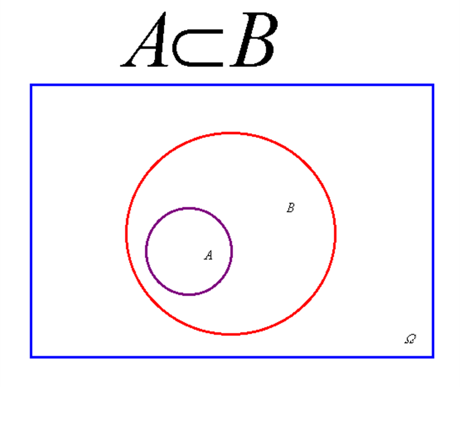
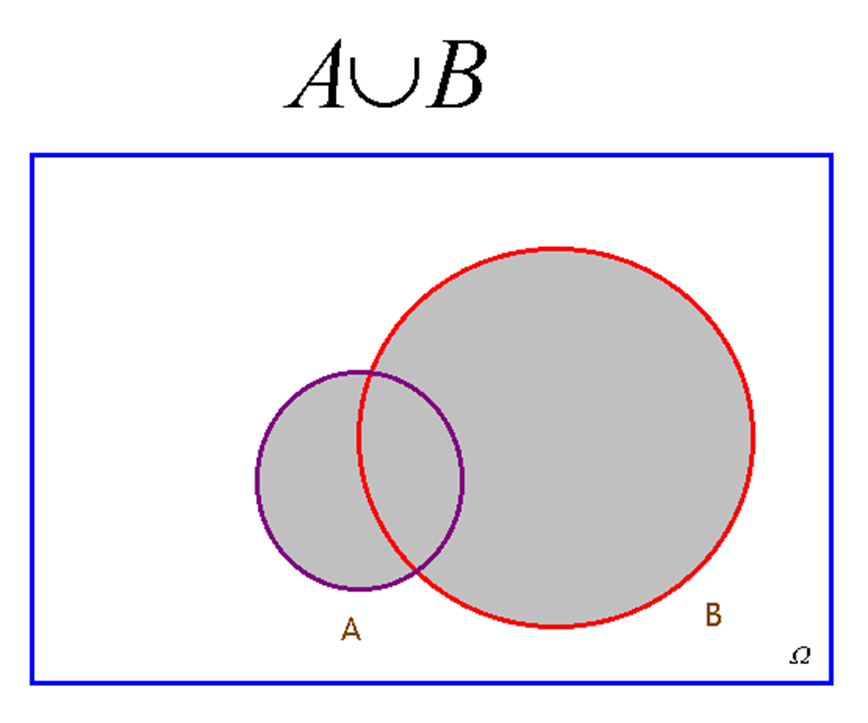
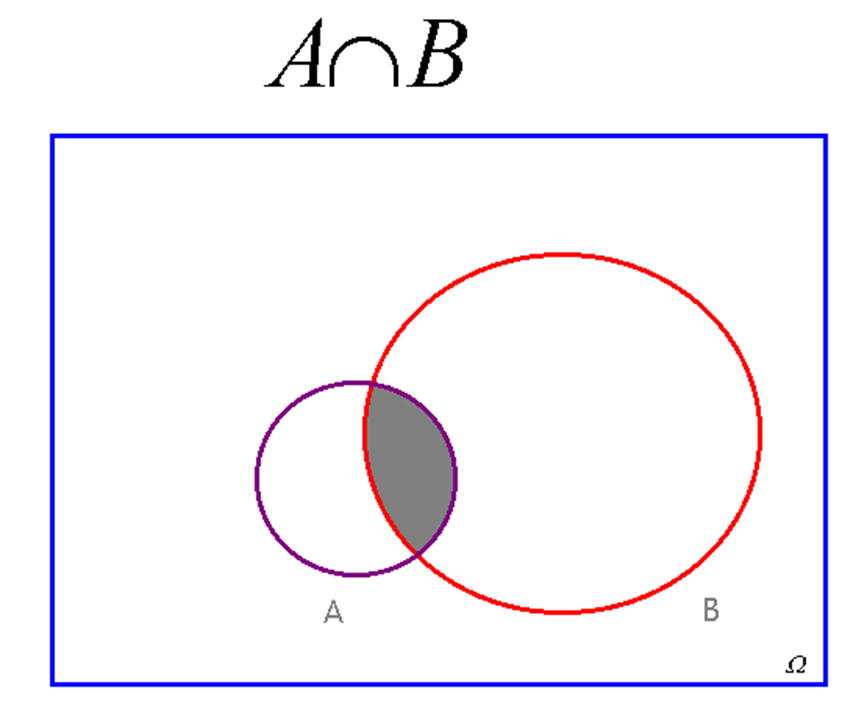
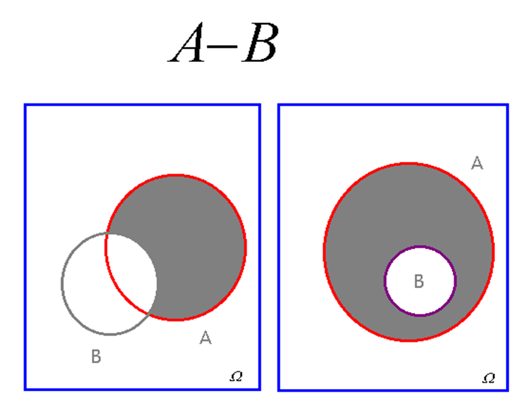

# 随机事件
## 事件的基本概念
- $\Omega$:

        样本空间,是试验的所有可能结果所组成的集合.

- $\omega$:

        样本点,是试验的每一个结果或样本空间中的一个元素

- (随机)事件:

        样本空间的子集,通常用大写的英文字母表示,如ABC

- 基本事件

        由一个样本点组成的单点集称为一个基本事件
- 复合事件

        包含不只一个可能结果的集合

## 事件间的关系

| 关系        | 含义与表示                                                                                                                                          |
| ----------- | --------------------------------------------------------------------------------------------------------------------------------------------------- |
| 包含关系    | A发生必导致B发生”记为$A \subset B$.当$A \subset B且B \subset A$时则可以说$A=B$             |
| 和事件/并集 | 事件A与B至少一个发生,写作$A \cup B$如果n个事件$A_1,\cdots,A_n$至少一个发生,记为:$\displaystyle \bigcup_{i=1}^nA_i$ |
| 积事件      | 事件AB同时发生, 记为$A \cap B=AB.$    若n个事件$A_1,\cdots,A_n$同时发生,则写为$A_1A_2\cdots A_n$            |
| 差事件      | A－B称为A与B的差事件, 表示事件A发生而B不发生                                                                |
| 互逆事件    | $A \cup B =\Omega 且AB=\phi$,则可以记为$B=\overline{A}$,事件AB互为对立事件                                                                          |

$\mathscr{F}$

# 经典概率模型
## 古典概型
**古典概型**也叫做**等可能概型**,定义为:若随机现象$\mathbf{E}$满足:
1. 有限性:样本空间$\Omega = {E_1,E_2,\cdots,E_n}$
2. 等可能性:$P(E_1) = P(E_2)=\cdots=P(E_n)$
则E可以称为**古典概型**也可以叫做**等可能概型**.

设有n个球，每个球都能以同样的概率$\displaystyle \frac{1}{N}$落到N个各自的每个格子中，试求:
1. 某指定的n歌格子中各有一个球的概率

$$
\begin{align*}
    &n个球,N个格子,一共有N^n种可能 \\
    \because& 共有n个球,且指定n个格子 \\
    \therefore& n个格子中,每个格子都有且仅有一个球 \\
    \Rightarrow& 第一个球有n个格子可以放,第二个球有n-1个格子可以放 \\
    \therefore& 满足条件的事件有n!种 \\
    \therefore& P_1=\frac{n!}{N^n}

\end{align*}
$$
2. 任何n个格子中各有一个球的概率

$$
\begin{align*}
    & 这是一个组合问题,任何n个格子各有一个球\\
    \Rightarrow &n \leq N\\
    \therefore& n个格子一共有\begin{pmatrix}
        N\\n
    \end{pmatrix}种组合方法 \\
    \therefore&  P_2=\begin{pmatrix}
        N\\n
    \end{pmatrix}  \times P_1 \\
    &P_2=\frac{N!}{N^n(N-n)!}\\

\end{align*}
$$

## 几何概型
古典概型适合可能性为离散值的情况,但是对于值为连续值的情况就没办法了,所以需要**几何概型**:
$$
设事件\mathbf{A}是\Omega的某个区域，它的面积为\mu(A)，则向区域\Omega上随机投掷一点，该点落在区域\mathbf{A}的概率为: \\
P(A)=\frac{\mu(A)}{\mu(\Omega)}
$$

# 概率
以$\Omega$为样本空间,$\mathcal{F}$为$\Omega$上的事件域,P定义为$\mathcal{F}$上的实值函数,若P满足:
1. 非负性:$\forall A \in \mathcal{F},P(A)\geq 0$;
2. 规范性:$P(\Omega)=1$;
3. 可列可加性:对于$\mathcal{F}$中任何可列无穷多个互不相容的事件$A_1,\cdots,A_k,\cdots$, 
$$
P\left ( \cup_{k=1}^\infty \right )=\sum_{k=1}^\infty P(A_K) 
$$
则可以称P为$\mathcal{F}$的$\mathbf{概率测度}$,简称$\mathbf{概率(probability)}$;称$(\Omega,\mathcal{F},P)$为$\mathbf{概率空间(probability space)}$;称$P(A)$为事件A的概率.

## 概率的基本定义

- 定理 1.2.2.（加法公式）

设 $(\Omega, \mathcal{F}, P)$ 为概率空间。

1. 若 $A, B \in \mathcal{F}$，则：

   $$
   P(A \cup B) = P(A) + P(B) - P(AB) 
   $$

2. 若 $A_1, \dots, A_n \in \mathcal{F}$，则：

$$
\begin{align*}

P\left( \bigcup_{k=1}^{n} A_k \right) = \sum_{k=1}^{n} P(A_k)
&- \sum_{1 \leq i < j \leq n} P(A_i A_j)\\
&+ \sum_{1 \leq i < j < k \leq n} P(A_i A_j A_k) \\
&- \cdots \\
&+ (-1)^{n-1} P(A_1 A_2 \cdots A_n)  \\
\end{align*}
$$

# 条件概率
## 全概率公式
设$A_1,\cdots,A_n$是$\Omega$的一个划分,且$P(A_i) > 0,(i=1,\cdots,n)$,则对任何事件$B \in \mathscr{F}$,有:
$$
P(B)=\sum_{i=1}^n P(A_i)P(B|A_i)
$$

## Bayes公式
Bayes公式可以看成全概率公式的逆.

设$A_1,\cdots,A_n$是$\Omega$的一个划分,且有$P(A_i) >0,(i=1,\cdots,n)$,则对任何事件$\mathbf{B} \in \mathscr{F}$,有:
$$
\begin{split}    
P(A_j|B)&=\frac{P(A_jB)}{P(B)}\\
&=\frac{P(B|A_j)P(A_j)}{\sum_{i=1}^n P(B|A_i)}\\
&=\frac{P(A_j)P(B|A_j)}{\sum_{i=1}^n P(A_i)P(B|A_i)},(j=1,\cdots,n)\\
\end{split}
$$

Bayes也叫做逆概率公式,主要用途在于知道结果反推原因.在贝叶斯公式中的使用场景中,各个$P(A_i)$是前提已知量,叫做**先验概率(prior probability)**.而$P(A_j|B)$是在事件B发生的情况下,$A_j$发生的概率,也叫做**后验概率(posterior probability)**.