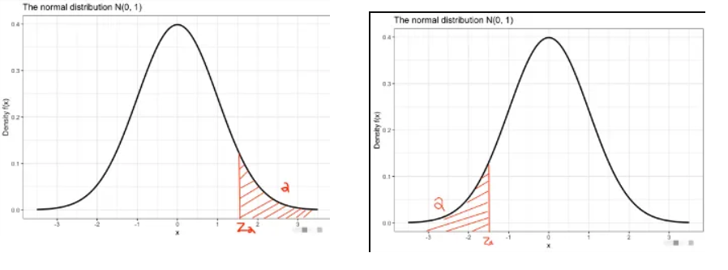

# 基本概念

## 随机变量

- 将事件数值化,将事件(文本)映射为数字,因为数字是符号,是可以运算的。但是事件的描述很多是文字,而随机变量就是事件的符号化表达。
- 这种符号化的映射通过实值函数实现。
- 随机变量简记为r,v。
- 随机变量通常用大写字母XYZ或希腊字母$\xi,\zeta,\eta$表示。

## 分布函数

设$X$为一个随机变量，$x$为任意实数，称下列函数为$X$的**分布函数**：
$$
F(X) =P\{X \leq x\} \qquad(-\infty<x<+\infty)
$$

分布函数的值$F(x)$表示$X$落在区间$(-\infty,x]$上的概率。（注意左开右闭）
$$
\begin{align*}
P\{x_1<X\leq x_2\}&=p\{X\leq x_2\}-P\{X\leq x_1\} \\
&=F(x_2)-F(x_1)
\end{align*}
$$

# 离散型随机变量分布

## 常数随机变量分布（退化分布）

**常数随机变量（退化分布）**在样本空间中**仅取一个值**。如$X \equiv c$,此时有:
$$
P(X \equiv c) =1
$$

常数随机变量的结果只有一个，是一个必然的事件。

## 两点分布/0-1分布/Bernoulli分布

### 基本概念

常数随机变量(退化分布)的结果只取一个值，是一个必然事件。而**两点分布**可以且仅可以取两个值，如0和1。且条件为：
$$
\begin{align*}
P(X=a)&=p \\
P(X=b)&=1-p
\end{align*}
$$
则其分布列可以表示为：
$$
\begin{pmatrix}
    a & b\\
    p & 1-p
\end{pmatrix}
$$

则称$X$服从**两点分布**或**0-1分布**，记作$X \sim b(1,p)$其中`1`表示实验一次，`p`表示每次实验的结果为`1`的概率为$p$。

如果进行多次实验，用$X$表示出现`1`的次数，那么`X`可取$0,1,2,\cdots,n$,并且：
$$
P\left (\omega : X( \omega \right )=k)=
\begin{pmatrix}
n\\k
\end{pmatrix}p^k(1-p)^{n-k}=b\left(k;n,p \right)
$$
则称$X$服从参数为`n`和`p`的二项分布，记为$X \sim b(n,p)$。

### 二项分布的泊松近似

如果试验次数`n`很大，则计算二项概率的过程会非常麻烦，而泊松近似可以用于求解大数`n`时的概率。

**Poisson定理：**

设有前提条件:
\[
\lim_{n \to \infty} n p_n = \lambda > 0
\]

则对固定的$k$ ，有:

$$
\begin{align*}
\lim_{n \to \infty}
\binom{n}{k} p_n^k (1 - p_n)^{n - k}
&=e^{-\lambda} \frac{\lambda^k}{k!}\\
\quad  k &= 0, 1, 2, \ldots\\
\lambda &=np
\end{align*}
$$

在泊松定理中，要求$\lim_{n \to \infty} n p_n = \lambda > 0$,即当$n$很大时，$P_n$必然得很小。

## Possion分布

如果一个随机变量$X$取非负整数$0,1,2,\cdots,$且其分布函数如下：
$$
P\left ( X=k\right )=e^{-\lambda}\frac{\lambda ^k}{k!},k=0,1,2,\cdots
$$
则可以称$X$为Possion随机变量或称$X$服从Possion分布，其中$\lambda$为其参数，记为$X \sim P(l)$

## 几何分布

考虑一个随机试验 它只有两个结果，如成功和失败，概率为$p,1-p$。现将试验独立重复进行，直至出现成功为止。用$X$表示所需的试验次数，$X$只能为正整数，则$X$取各个值的概率为：
$$
P(x=k)=p(1-p)^{k-1}
$$
则称$X$服从几何分布，其中`p`为参数，记为$X \sim G(p)$。

几何分布具有**无记忆性**，无论已经试验多少次，直到成功还需的试验次数$X$仍为几何分布。
$$
P(X=m+k|X>m)=p(1-p)^{k-1}
$$

## 超几何分布

考虑**产品抽检**问题。 假定**N**件产品中有**M**件次品，现在随意不放回抽检`n`件，用`X`表示其中所含次品的个数。那么:
$$
\begin{align*}
P(X=k)&=\frac{\begin{pmatrix}
    M\\k
\end{pmatrix}\begin{pmatrix}
    N-M \\n-k
\end{pmatrix}}{\begin{pmatrix}
    N\\n
\end{pmatrix}} \\
k&=0,1,2,\cdots,min(n,M)\\
k&=max(0，n+M-N)，\cdots,min(n,M)
\end{align*}
$$

若抽样时$n,k$不变，$M/N \textcircled{\textregistered} \ p$,则有：
\[
\frac{
\binom{M}{k} \binom{n - M}{n - k}
}{
\binom{N}{n}
}
\rightarrow
\binom{n}{k} p^k (1 - p)^{n - k}
\]

当**N**很大时，不放回抽检和放回抽检比较接近，此时可以用**二项分布**来近似**超几何分布**。

# 连续型随机变量分布

## 基本概念

### 概率密度
对于随机变量X，$f(x)$为**非负可积函数**，$x \in (-\infty,+\infty)$,使得对于任何实数$x$有：
$$
F(x)=\int_{-\infty}^xf(t)dt=P(X \leq x)
$$
则称$X为连续型随机变量$，称$f(x)$为$X$的**概率密度函数**，简称**概率密度**

### 生存分析和生存函数
生存分析：使用概率论的方法分析一个事物的预期寿命。
$$
寿命=x+T
\begin{cases}
    x:当前寿命，这个寿命一般是已知的\\
    T：剩余寿命，这个值是随机变量
\end{cases}
$$

概率分布函数$P(X\leq x)$可以看成一个**死亡函数**，其表示的函数是随机变量$X$的寿命小于$x$的概率，**生存函数**可以看成分布函数的逆，其定义为：
$$
S(t)=P(\{T>t\})=\int_t^\infty f(u)du=1-F(t)
$$

**危险率函数**用于描述**某一时刻**事件发生的瞬时风险。假设`t`时刻随机变量`X`还活着，但是会在$t+\delta t$时刻死亡，则该事件为一个条件概率：
$$
\begin{align*}
t时刻X的生存周期为：&P(X>t) \\
t时刻存活，但\Delta  t时刻死亡的概率为：&P(t<X\leq t+\Delta t) \\
则在t+\Delta t前死亡的概率为：&P(t<X\leq t+ \Delta t|X>t) \\   
令\Delta \rightarrow 0,则有&P(t<X\leq t+ \Delta t|X>t)可以表示在t时刻死亡的概率\\
P(t<X\leq t+ \Delta t|X>t)=&\frac{P(t<X\leq t+ \Delta t)}{P(X>t)} \\
=&\frac{f(t)\Delta t}{1-F(t)} \\
将\Delta t提出，则h(t)=&\frac{f(t)}{1-F(t)}可以用于衡量危险程度，值越大在该处死亡的条件概率越大
\end{align*}
$$

即：$h(x)=\frac{f(x)}{1-F(x)}$为X的**危险率函数**。

## 常用连续型随机变量分布
### 均匀分布

如果随机变量 \( X \) 在 \([a,b]\) 上取值，并且取每个值是等可能的，即具有概率密度函数

\[
f(x) =
\begin{cases}
\frac{1}{b-a}, & \text{当 } a \leq x \leq b \\
0, & \text{其他}
\end{cases}
\]

那么称 \( X \) 服从 \([a,b]\) 上的均匀分布，记作 \( X: U[a,b] \)。
其对应的分布函数为：
$$
F(x)=\begin{cases}
    0,&x \leq a \\
    \frac{x-a}{b-a},&a<x\leq b \\
    1,&x>b
\end{cases}
$$
### 指数分布

若随机变量在$[0,\infty)$上取值，具有概率密度函数：
$$
f(x) = \begin{cases} 
\lambda e^{-\lambda x}, & 0 \leq x < \infty \\
0, & 其它
\end{cases}
$$
其中 $\lambda > 0$， 那么称 X 服从参数为 $\lambda$ 的指数分布，记作 $X : E(\lambda)$。

相应的分布函数为：
$$
F(x)=\begin{cases}
    0,&x<0\\
    1-e^{-\lambda x}, &0\leq x<\infty
\end{cases}
$$

### 正态分布

#### 正态分布基本概念

若连续型随机变量 \( X \) 的概率密度为：

\[
f(x) = \frac{1}{\sqrt{2\pi\sigma^2}} e^{-\frac{(x-\mu)^2}{2\sigma^2}}, \quad -\infty < x < \infty
\]

其中 \( \mu \) 和 \( \sigma^2 (\sigma > 0) \) 都是常数，则称 \( X \) 服从参数为 \( \mu \) 和 \( \sigma^2 \) 的正态分布或高斯分布。记作

\[
X \sim N(\mu, \sigma^2)
\]

其对应的分布函数为:$\displaystyle F(x)=\frac{1}{\sqrt{2\pi}\sigma} \int_{-\infty}^x e^{-\frac{(t-u)^2}{2\sigma ^2}}dt,-\infty<x<\infty$。

#### 标准正态分布

$\mu = 0, \sigma = 1$的正态分布称为标准正态分布. 记为$X \sim N(0,1)$

其密度函数和分布函数分别为$\phi(x)$和$\Phi(x)$表示:
$$
\begin{align*}
\phi(x) &= \frac{1}{\sqrt{2π}} e^{\frac{-x²}{2}} &-∞ < x < ∞ \\
Φ(x) &= \frac{1}{\sqrt{2π}} ∫_{-∞}^{x} e^{\frac{-t²}{2}} dt &-∞ < x < ∞
\end{align*}
$$

若$X \sim N(\mu,\sigma^2)$,则有$Z=\frac{X-\mu}{\sigma} \sim N(0,1)$。任何一般正态分布都可通过线性变换转换为标准正态分布。

#### 正态分布3σ准则

标准正态分布有$3\sigma 准则$：
$$
P(|X|\leq 1)=2 \times [\Phi(1)-\frac{1}{2}]=2\Phi(1)-1=0.6826 \\
P(|X|\leq 2)=2 \times [\Phi(2)-\frac{1}{2}]=2\Phi(2)-1=0.9544 \\
P(|X|\leq 3)=2 \times [\Phi(3)-\frac{1}{2}]=2\Phi(3)-1=0.9974 \\
$$
则说明，随机变量$X$的取值几乎集中在$[-3,3]$内，如果是非标准正态分布则是在$[-3\sigma,3\sigma]$区间之内。

#### 标准正态分布α分位点
在标准正态分布中，若数$z_\alpha$满足：
$$
\begin{align*}
&P\{Z>\mathscr{z_{\alpha}}\}&=\alpha \\
\Rightarrow &P\{Z<-\mathscr{z_{1-\alpha}}\}&=\alpha
\end{align*}
$$

$Z_{1-\alpha}叫做下\alpha 分位点。 Z_{\alpha}则叫做上\alpha 分位点$