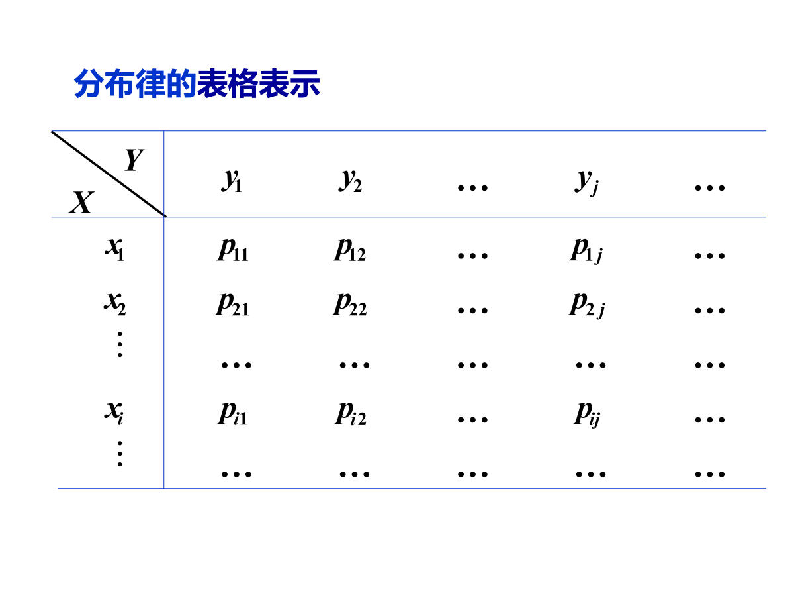
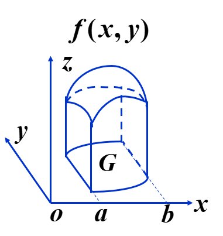
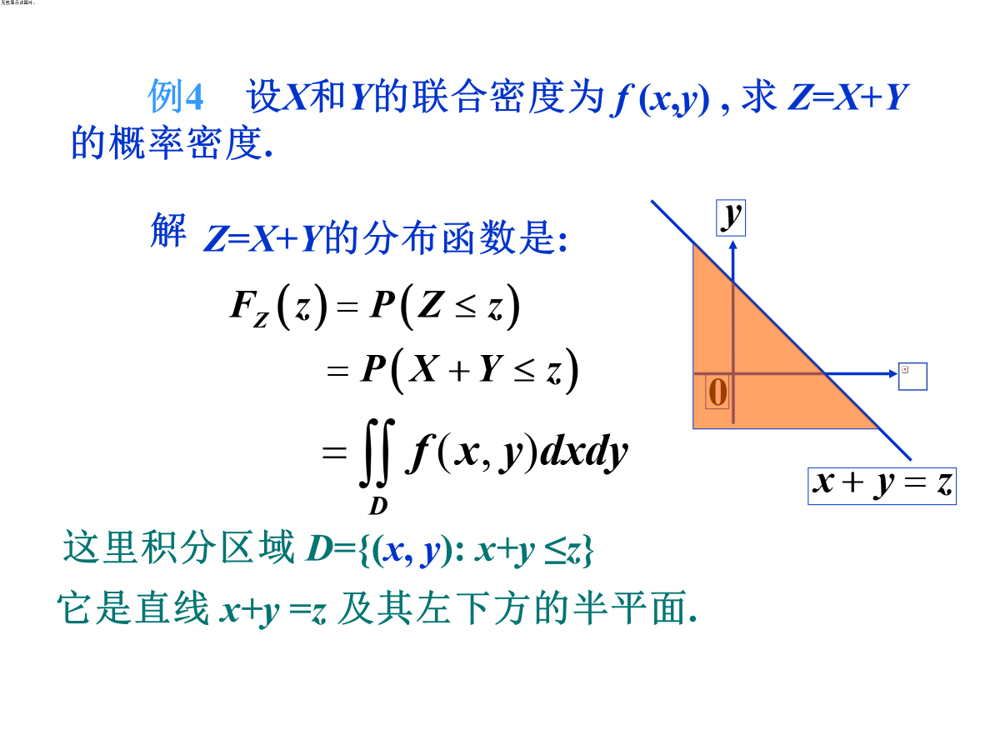

# 二维随机变量的分布函数
## 联合分布函数
令$(X,Y)$为二维随机变量，对于任意实数$x,y$，二元函数：

$$
\begin{align*}
F(X,Y)&=P \left \{ (X \leq x) \cap (Y \leq y) \right \} \\
&=P \left ( X \leq x,Y \leq y \right )
\end{align*}
$$
称为二维随机变量$(X，Y)$的**分布函数**，或者叫做随机变量$X和Y$的**联合分布函数**。

## 边缘分布函数

联合分布函数$F(X,Y)$对于随机变量$X,Y$的各自的分布函数，分别记为$F_X(x),F_Y(y)$。依次称为二维随机变量(X,Y)关于X和Y的**边缘分布函数**。
$$
\begin{align*}
    F_X(x)&=P\{X \leq x\}=P\{X \leq x,Y < +\infty\}=F(x,+\infty) \\
    F_Y(y)&=P\{Y \leq y\}=P\{X \leq +\infty,Y < y\}=F(+\infty,y) \\
\end{align*}
$$

# 二维离散型随机变量
设二维离散型随机变量$(X,Y)$可能的取值为$(x_i,y_i),i，j=1,2,\dots$,记
$$
\begin{align*}
P(X=x_i,Y=y_j)&=p_{ij} \\
i,j&=1,2,\dots
\end{align*}
$$
## 二维离散型随机变量的表格表示

# 二维连续型随机变量
## 分布函数定义
二维随机变量(X,Y)的分布函数为：
$$
F(x,y)=\int_{-\infty}^y \int_{-\infty}^x f(u,v)dudv
$$
其中，$f(x,y)$称为二维随机变量$(X,Y)$的**概率密度**，或者也叫做随机变量X和Y的**联合概率密度**。

## 概率密度的性质
### 性质1：定义
若$f(x,y)$在点$(x,y)$处连续，则有：
$$
\frac{\partial ^2 F(x,y)}{\partial x \partial y}= f(x,y)
$$

### 性质2：几何意义
令$z=f(x,y)$表示随机变量$(X,Y)$在(x,y)处的概率，令$G$为$xoy$平面上的任意一个区域，则有：
$$
P\{ (X,Y) \in G\}=\substack{\iint \\G}f(x,y)dxdy
$$
该公式的表示以$G$为底，以曲面$f(x,y)$为顶面的曲顶柱体的体积。

## 常见的二维连续型随机变量分布
### 均匀分布

设$G$为平面上的有界区域，其面积为$A$，若二维随机变量$(X,Y)$具有概率密度：
$$
f(x,y)=\begin{cases}
    \frac{1}{A},&(x,y) \in G \\
    0,&其他
\end{cases}
$$
则称(X,Y)在$G$上服从**均匀分布**。

## 二维正态分布

### 联合分布函数

二维随机变量$(X,Y)$的概率密度为：
\[
f(x,y) = \frac{1}{2\pi\sigma_x\sigma_y\sqrt{1-\rho^2}}
\exp\!\left(
-\frac{1}{2(1-\rho^2)}\left[
\left(\frac{x-\mu_x}{\sigma_x}\right)^2
-2\rho \frac{(x-\mu_x)(y-\mu_y)}{\sigma_x\sigma_y}
+\left(\frac{y-\mu_y}{\sigma_y}\right)^2
\right]
\right)
\]

其中$\sigma _x >0,\sigma _y > 0, -1 < \rho <1$,称$(X,Y)$为服从参数为$\mu_x,\mu_y,\sigma _x,\sigma _y,\rho $的二维正态分布，记为$(X,Y) \sim N_2(\mu_x,\mu_y,\sigma _x^2,\sigma _y^2,\rho )$

### 边缘概率密度
<!-- TODO:边缘密度函数公式推导 -->
$$
\begin{align*}
f_x(x) &=\int _{-\infty}^{+\infty}f(x,y)dy \\
&=
\end{align*}
$$

二维正态分布的两个边际分布都是一维正态分布。

$$
\begin{align*}
    &(X,Y) \sim N_2(\mu_x,\mu_y,\sigma _x^2,\sigma _y^2,\rho ) \\
    \Rightarrow &\begin{cases}
        X \sim N(\mu _x,\sigma_x^2) \\
        Y \sim N(\mu _y,\sigma_y^2) \\
    \end{cases}
\end{align*}
$$
即，边缘分布中的参数与二元正态分布中的常数$\rho$无关。
若$\rho =0$, 则X与Y独立
<!-- TODO:# 相互独立的随机变量 -->

# 条件分布
## 离散型随机变量的条件分布
设 $(X,Y)$ 是二维离散型随机变量， 对于固定的 $j$，若 $P\{Y = y_j\} > 0$，则称
$$
P\{X = x_i \mid Y = y_j\}
= \frac{P\{X = x_i, Y = y_j\}}{P\{Y = y_j\}}
= \frac{p_{ij}}{p_{\cdot j}}, \quad i = 1, 2, \ldots
$$
为在 $Y = y_j$ 条件下随机变量 $X$ 的**条件分布律**。

## 连续型随机变量的条件分布

由于$P\{X=x\}=0,P\{Y=y\}=0$,不能直接使用条件概率公式得到条件分布。
条件概率密度的定义为：
设 $(X,Y)$ 是连续型随机向量，它的联合分布密度为 $f(x,y)$，且 $f_Y(y) > 0$，则称
$$
\begin{align*}
F(x \mid y) &\;\hat{=}\; P\{X \leq x \mid Y \in dy\} \\
&= \frac{\int_{-\infty}^x f(u,y)\,dy\,du}{f_Y(y)\,dy} \\
&= \int_{-\infty}^x \frac{f(u,y)}{f_Y(y)} \, du
\end{align*}
$$
为在 $Y=y\,(Y \in dy)$ 下 $X$ 的条件分布函数。

记在 $Y=y\,(Y \in dy)$ 下 $X$ 的条件密度为 $f(x \mid y)$，则由上式得
\[
f(x \mid y) = \frac{f(x,y)}{f_Y(y)}, \qquad (f_Y(y) > 0).
\]

在$X=x$的条件下，$Y$的条件分布仍然是正态分布：
$$
N\left (\mu _y+\rho\frac{\sigma_y}{\sigma_x}(x-\mu_x),\sigma_y^2(1-\rho^2)\right)
$$
# 随机变量函数的分布
假设随机变量X,Y的联合分布已知，令$Z=g(X,Y)$,则如何求$Z$的分布？
## 离散型

离散型就是相加即可。

## 连续型

设 \( (X, Y) \) 为二维连续型随机变量, 其联合概率密度为\( f(x, y) \), 则\( Z = g(X, Y) \)的分布函数为：

$$
\begin{align*}
F_Z(z) &= P\{Z \leq z\} = P\{g(X, Y) \leq z\} \\
&= \iint_D f(x, y) \, dx \, dy \\
&= \iint_{g(x, y) \leq z} f(x, y) \, dx \, dy \\
\end{align*}
$$

连续型二维随机变量函数的分布函数通过**二重积分**计算，计算前需要先确定区域$D$。

<!-- TODO：使用积分转换法计算连续随机变量函数的概率密度函数和分布 -->