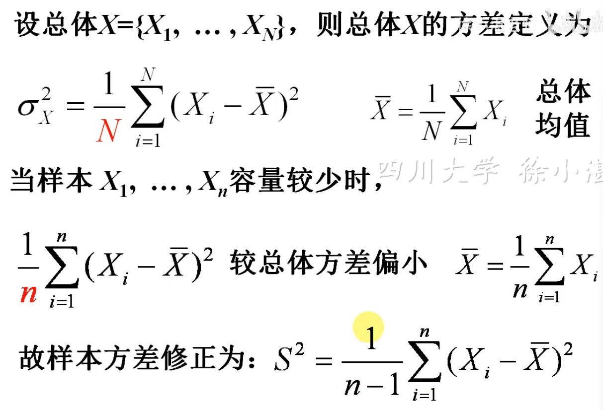
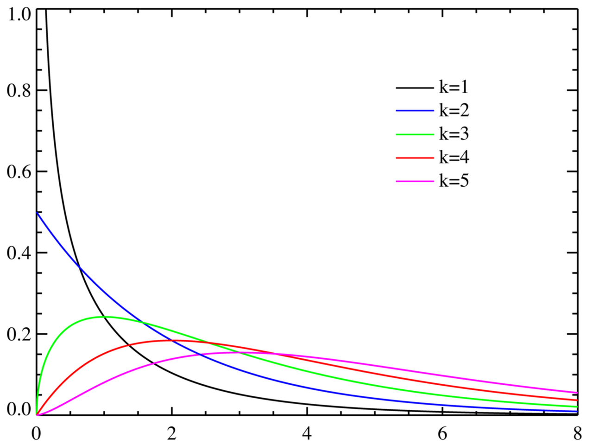
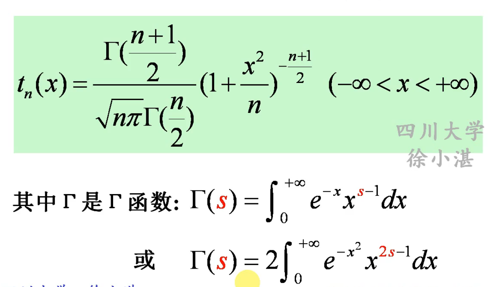
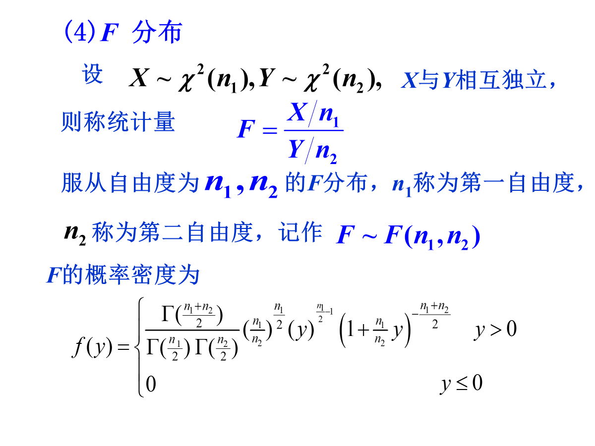
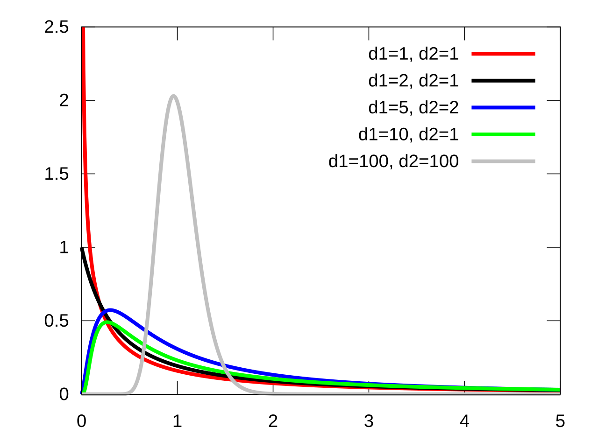
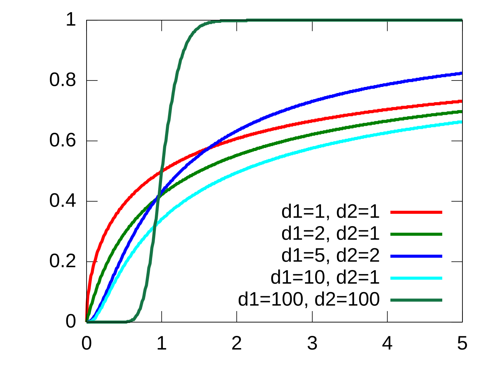

# 抽样分布

统计量：**不包含任何未知参数**的样本的**函数**称为**统计量**。

抽样：从总体中抽取样本（简称抽样），必须满足两个条件：
- 随机性：抽样应**随机**进行，使得每个个体被抽到的机会均等。
- 独立性：每次抽样应**独立**进行，其结果不受其他抽样结果的影响，也不影响其他抽样的结果。
满足此两个条件的抽样便称为**简单随机抽样**，得到的样本称为**简单随机样本**

对有限样本应使用**有放回抽样**，无限样本或大容量样本可使用**不放回抽样**

# 统计量

## 统计量的定义

设$X_1,\dots,X_n$是来自总体$X$的一个样本，$g(X_1,\dots,X_n)$是$X_1,\dots,X_n$的函数，若$g$中**不含有未知参数**，则称$g(X_1,\dots,X_n)$是一个**统计量**

因为$X_1,\dots,X_n$都是随机变量，所以统计量$g(X_1,\dots,X_n)$作为$X_1,\dots,X_n$的函数也是随机变量。

设$x_1,\dots,x_n$是相应样本$X_1,\dots,X_n$的**样本值**。则称$g(x_1,\dots,x_n)$是统计量$g(X_1,\dots,X_n)$的观测值。

## 常用的统计量

样本平均值$\overline{X}=\frac{1}{n}\sum_{i}^nX_i$

（修正后的）样本方差:当样本量小时，用$n-1$方差更大更明显，当样本量很大时$n-1$和$n$没啥区别。
$$
\begin{align*}
S^2&=\frac{1}{n-1}{\sum_{i=1}^n(X_i-\overline{X})^2} \\
&=\frac{1}{n-1}{\sum_{i=1}^nX_i^2-n\overline{X}^2}
\end{align*}
$$

k阶原点距$A_k=\frac{1}{n}\sum_{i=1}^nX_i^k$

K阶中心距$B_k=\frac{1}{n}\sum_{i=1}^n(X_i-\overline{X})k$

若总体的k阶距存在，则样本的k阶矩也依概率收敛到k阶矩。

# 抽样分布

统计量的几个分布。

## 开平方分布（卡方分布）

### Γ分布

若连续型随机变量的概率密度函数为：
$$
\begin{align*}
\large
f(x)=\begin{cases}
\huge
\frac{1}{\Theta^\alpha\Gamma(\alpha)}x^{\alpha-1}e^{-\frac{x}{\Theta}},&\quad x >0 \\
0,&\quad x \leq 0
\end{cases}
\end{align*}
$$
其中参数$\alpha和\Theta$为正常数，则称$X$服从参数为$\alpha、\Theta$的$\Gamma$分布，记为$X \sim \Gamma(\alpha,\Theta)$

### 定义和概率密度函数

设$X_1,\dots,X_n$是来自总体$N(0,1)$的样本。即$X_1,\dots,X_n$相互独立且都服从标准正态分布，则称统计量（平方和）
$$
\mathcal{X}^2=X_1^2+\dots+X_k^2
$$
服从自由度为$n$的$\mathcal{X}^2$分布（卡方分布）,记为$\mathcal{X}^2\sim \mathcal{X}^2(k)$。自由度就是独立变量的个数。

卡方分布的概率密度函数（PDF）为：
$$
\large
\begin{align*}
f_X(x) = \begin{cases}
\huge
\frac{1}{2^{\frac{k}{2}} \Gamma\left(\frac{k}{2}\right)}x^{\frac{k}{2}-1} e^{-\frac{x}{2}}, &\quad x \geq 0 \\
0,&\quad x \leq 0
\end{cases}
\end{align*}
$$
其中$\Gamma$为$\Gamma$函数，其函数表达式为：$\displaystyle \Gamma(s)=\int_0^{+\infty}e^{-x}x^{s-1}dx$

卡方分布的概率密度函数为：

## t分布

$X \sim N(0,1),Y \sim \mathcal{X}^2(n)$,且$X，Y$相互独立，则称随机变量:
$$
t=\frac{X}{\sqrt{Y/n}}
$$
服从自由度为$n$的t分布（学生式分布)>,记为$t \sim t(n)$

性质：

- 偶函数，图像关于y轴对称

## F分布

