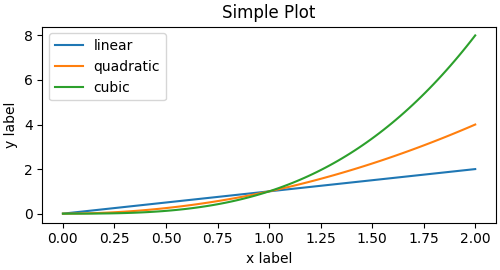

# Matplotlib画图基础
## 画图的基本概念
### figure
在`matplotlib`中，在任何绘图之前，我们需要一个 Figure 对象，可以理解成我们需要一张画板才能开始绘图。一个`figure`就是一个窗口，是`axes`的容器。特点是代码中定义几个`figure`，`plt.show()`的时候显示器上就会弹出几个窗口。其基本的定义为：
  ``` python 
"""
 num:图像编码或者名称，数字是编码，字符串是名称
 figsize：宽和高，单位是英尺
 dpi：指定绘图对象的分辨率，即每英寸多少个像素，缺省值为80
 facecolor：背景颜色
 edgecolor：边框颜色
 frameon：是否显示边框
"""
plt.figure(num=None, figsize=None, dpi=None, facecolor=None, edgecolor=None, frameon=True)
  ```

除此之外，定义Figure的方法还有：

``` python
fig = plt.figure()             # an empty figure with no Axes
fig, ax = plt.subplots()       # a figure with a single Axes
fig, axs = plt.subplots(2, 2)  # a figure with a 2x2 grid of Axes
# a figure with one Axes on the left, and two on the right:
fig, axs = plt.subplot_mosaic([['left', 'right_top'],
                               ['left', 'right_bottom']])
```

### Axes

`axes`：轴，其实也就是一个坐标系，没有轴的话就没有绘图基准，所以需要添加`Axes`。也可以理解成为真正可以作画的位置。`axes`需要依赖于`figure`才能存在。官方介绍是：

The [`Axes`](https://matplotlib.org/stable/api/_as_gen/matplotlib.axes.Axes.html#matplotlib.axes.Axes) class represents one ==(sub-)plot== in a ==figure==. It contains the ==plotted data==, ==axis ticks==, ==labels==, ==title==, ==legend==, etc. Its methods are the main interface for manipulating the plot.

An Axes is an Artist attached to a Figure that contains a region for plotting data, and usually includes ：two (or three in the case of 3D) [`Axis`](https://matplotlib.org/stable/api/axis_api.html#matplotlib.axis.Axis) objects (be aware of the difference between **Axes** and **Axis**) that provide ticks and tick labels to provide scales for the data in the Axes。

每一个axes的基本成员及设置方法为：

| member     | function                                                     |
| ---------- | ------------------------------------------------------------ |
| `title`    | [`set_title()`](https://matplotlib.org/stable/api/_as_gen/matplotlib.axes.Axes.set_title.html#matplotlib.axes.Axes.set_title) |
| ` x-label` | [`set_xlabel()`](https://matplotlib.org/stable/api/_as_gen/matplotlib.axes.Axes.set_xlabel.html#matplotlib.axes.Axes.set_xlabel) |
| `y-labe`   | [`set_ylabel()`](https://matplotlib.org/stable/api/_as_gen/matplotlib.axes.Axes.set_ylabel.html#matplotlib.axes.Axes.set_ylabel) |


### Figure的基本组成

使用`matplotlib`绘的图结构如下图所示：


其中，figure和axes等所有可见的元素都叫做**Artist**，在figure渲染时，所有的artist都被画到canvas上。

Basically, everything visible on the Figure is an Artist (even [`Figure`](https://matplotlib.org/stable/api/_as_gen/matplotlib.figure.Figure.html#matplotlib.figure.Figure), [`Axes`](https://matplotlib.org/stable/api/_as_gen/matplotlib.axes.Axes.html#matplotlib.axes.Axes), and [`Axis`](https://matplotlib.org/stable/api/axis_api.html#matplotlib.axis.Axis) objects). This includes [`Text`](https://matplotlib.org/stable/api/text_api.html#matplotlib.text.Text) objects, [`Line2D`](https://matplotlib.org/stable/api/_as_gen/matplotlib.lines.Line2D.html#matplotlib.lines.Line2D) objects, [`collections`](https://matplotlib.org/stable/api/collections_api.html#module-matplotlib.collections) objects, [`Patch`](https://matplotlib.org/stable/api/_as_gen/matplotlib.patches.Patch.html#matplotlib.patches.Patch) objects, etc. When the Figure is rendered, all of the Artists are drawn to the **canvas**. Most Artists are tied to an Axes; such an Artist cannot be shared by multiple Axes, or moved from one to another.

## 画图的基本过程

1. 创建Figure对象
2. 创建Axes对象
3. 确定data，axis ticks，labels等要素

### 数据输入

画图函数的输入只能是以下的几种数据类型：

1. [`numpy.array`](https://numpy.org/doc/stable/reference/generated/numpy.array.html#numpy.array) 
2. [`numpy.ma.masked_array`](https://numpy.org/doc/stable/reference/generated/numpy.ma.masked_array.html#numpy.ma.masked_array) 
3. 能够传递给 [`numpy.asarray`](https://numpy.org/doc/stable/reference/generated/numpy.asarray.html#numpy.asarray)的其他数据类型

如果是其他数据类型就需要将其类型转换为这三种类型，例如pandas之类的数据就需要转换为`numpy.array`。


# 编码格式


有两种基本的绘图编码风格：

1. 面向对象风格编码：使用面向对象的思想显式创建figure和axes对象
2. pylpot风格：这种风格隐式地创建figure和axes对象

## 面向对象编码风格

该风格基本就的过程就是：

1. 调用api创建figure和axes对象
2. 在axes中添加数据、label和title等

``` python
x = np.linspace(0, 2, 100)  # Sample data.

# Note that even in the OO-style, we use `.pyplot.figure` to create the Figure.
fig, ax = plt.subplots(figsize=(5, 2.7), layout='constrained')
ax.plot(x, x, label='linear')  # Plot some data on the Axes.
ax.plot(x, x**2, label='quadratic')  # Plot more data on the Axes...
ax.plot(x, x**3, label='cubic')  # ... and some more.
ax.set_xlabel('x label')  # Add an x-label to the Axes.
ax.set_ylabel('y label')  # Add a y-label to the Axes.
ax.set_title("Simple Plot")  # Add a title to the Axes.
ax.legend()  # Add a legend.
```



## 隐式编码风格

该编码并不直接创建`figure`和`axes` 对象，个人猜测他是创建了`figure`和`axes`对象，但是这些对象存在于上下文中。

``` python
x = np.linspace(0, 2, 100)  # Sample data.

plt.figure(figsize=(5, 2.7), layout='constrained')
plt.plot(x, x, label='linear')  # Plot some data on the (implicit) Axes.
plt.plot(x, x**2, label='quadratic')  # etc.
plt.plot(x, x**3, label='cubic')
plt.xlabel('x label')
plt.ylabel('y label')
plt.title("Simple Plot")
plt.legend()
```

画图的结果和上面的方式完全一样。