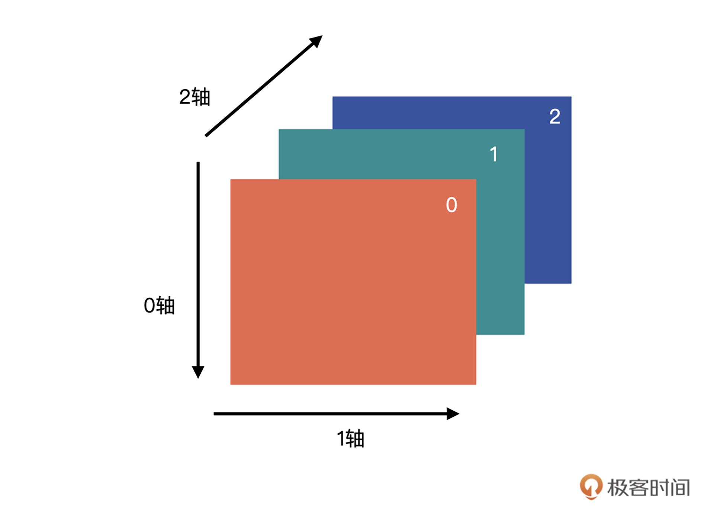
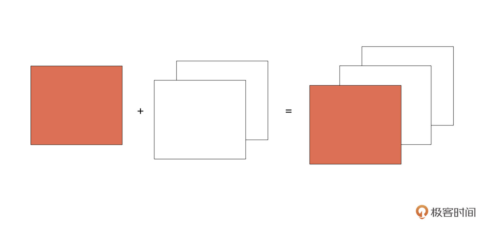

# Numpy介绍

numpy是python科学计算中最核心、最基础的库，用于执行高性能的数值计算。它提供了一个强大的 **N维数组对象（`ndarray`）**，并在此基础上构建了大量的数学函数和操作工具。对于同样的数值计算任务，使用numpy比直接使用python要简洁高效得多。

## numpy与原生list的区别

|| 原生list | numpy |
| -|------- | ----- |
| 长度 | 可以动态改变 | 固定大小 |
| 数据类型一致性 | 数据类型可以不同 | 数据类型相同 |


## numpy的常见用途

| 场景     | 应用示例                     |
| -------- | ---------------------------- |
| 数值计算 | 线性代数、微积分、矩阵操作   |
| 数据分析 | 数据清洗、批量计算、快速聚合 |
| 图像处理 | 图像矩阵化、像素运算         |
| 机器学习 | 数据预处理、特征归一化       |
| 仿真模拟 | 随机分布、模拟数据生成       |

# numpy的核心特性

## ndarray

`ndarray` 是 Numpy 中的核心特性之一，它是一个多维数组对象，存储**同类型数据**：`int`, `float`, `bool` ,`str` 。相对于python原生的数组，它最大的特点就是它是为了矩阵运算特化的，提高了计算的效率，提供了很多矩阵计算的方法。

## 广播机制

自动适配维度，实现不同形状数组之间的计算：

``` python
a = np.array([1, 2, 3])
b = 2
pri(a + b)  # 输出: [3 4 5]
```

对两个数组使用广播机制要遵守下列规则：

1. 如果数组的秩不同，使用**1**来将秩较小的数组进行扩展，直到两个数组的尺寸的长度都一样。
2. 如果两个数组在**某个维度上的长度是一样的**，或者其中一个数组**在该维度上长度为1**，那么我们就说这两个数组在该维度上是**相容**的。
3. 如果两个数组在**所有维度**上都是相容的，他们就能使用广播。
4. 如果两个输入数组的尺寸不同，那么注意其中较大的那个尺寸。因为广播之后，两个数组的尺寸将和那个较大的尺寸一样。
5. 在任何一个维度上，如果一个数组的长度为1，另一个数组长度大于1，那么在该维度上，就好像是对第一个数组进行了复制。

## 向量化操作，无需循环

### 原生list

传统 Python 中，我们处理多个数值时，通常会使用 **`for` 循环**，比如把列表中的每个元素都加1。

``` python
# 普通 Python 的方式
data = [1, 2, 3, 4]
result = []
for x in data:
    result.append(x + 1)
print(result)  # 输出 [2, 3, 4, 5]
```

### numpy

原生list进行计算的过程虽然清晰，但速度慢、代码冗长。**NumPy 可以用“向量化”方式直接写成一行代码，无需写循环：**

``` python
import numpy as np

data = np.array([1, 2, 3, 4])
result = data + 1
print(result)  # 输出 [2 3 4 5]
```

**向量化操作就是把一组数据作为整体来处理，而不是一个个地处理。**

这背后依赖的是 **底层的 C 语言实现**，能大幅提升执行效率，尤其是处理成千上万数据时，比 Python 的 `for` 循环快很多。

# ndarray的成员属性


| 属性    | 作用                                                         |
| ------- | ------------------------------------------------------------ |
| `ndim`  | 数组的维度，也称为数组的轴,例如一维数组`ndim=1`,二维数`ndim=2` |
| `shape` | 数组的形状，例如一个2×2的矩阵`shape=(2,2)`。可以通过`reshape()`重新指定数组的形状 |
| `size`  | 数组元素的个数，等于`shape`中各个元素的乘积                  |
| `dtype` | 数组中元素的类型。可以使用`astype()`可以改变数组的数据类型。(创建一个新数组，而不是改变原数组) |


# ndarray的成员函数

## 构造函数


| 函数                                                         | 作用                                                         |
| ------------------------------------------------------------ | ------------------------------------------------------------ |
| `np.ones()`                                                  |                                                              |
| `np.zeros()`                                                 |                                                              |
| `np.arange([start, ]stop, [step, ]dtype=None)`               | 创建一个在`[start, stop)` 区间的数组，元素之间的跨度是` step`。`start `是可选参数，默认为` 0`。`stop `是必须参数，区间的终点，请注意，刚才说的区间是一个左闭右开区间 |
| `np.linspace（start, stop, num=50, endpoint=True, retstep=False, dtype=None）` | 创建一个数组，具体就是创建一个从开始数值到结束数值的等差数列。`endpoint`：默认为 `True`，如果为` True`，则数组最后一个元素是 `stop`。<br />`retstep`：默认为 False，如果为 True，则返回数组与公差。 |
| `np.asarray()`                                               | 用于将结构化数据转化为`ndarray`,例如图片，图像一般是三维，(长，宽，通道数) |

# Numpy的应用场景

深度学习任务可以分解成**数据加载**、**训练**与**模型评估**三部分。其中**数据加载**跟**模型评估**中，就经常会用到 NumPy 数组的相关操作。

## 数据加载阶段

这个阶段我们要做的就是把训练数据读进来，然后给模型训练使用。训练数据不外乎这三种：**图片**、**文本**以及类似**二维表**那样的结构化数据。在读取数据这块，pytorch和scikit-learn都会先将数据转换为Numpy数组，然后进行后续操作。

通过使用`np.asarray()`可以将结构化的数据，如图像，转换成`ndarray``。

## 索引与切片

NumPy 数组的索引方式与 Python 的列表的索引方式相同，也同样支持切片索引。

在 NumPy 数组中经常会出现用冒号来检索数据的形式，如下所示：

``` python
im_pillow[:, :, 0]
```

“：”代表全部选中的意思。我们的图片读入后，会以下图的状态保存在数组中。

通过切片的方式可以获取图像中单通道的数据。



## 数组的拼接

NumPy 数组为我们提供了` np.concatenate((a1, a2, …), axis=0) `方法进行数组拼接。其中，`a1，a2, …`就是我们要合并的数组；`axis` 是我们要沿着哪一个维度进行合并，默认是沿着` 0` 轴方向。

所谓的数组的拼接就是沿着某一个轴，将多个数组拼成一个数组。例如一个`(3,3,1)`的数组A与2个`(3,3,1)`的数组B，沿着`axis=2`的方向进行拼接，拼接成一个`（3，3，3）`的数组。如下图，红色的为数组A，白色的为数组B。



注意：沿着`axis=2`的方向对两个数组进行拼接的前提是两个数组都有`axis=2`的轴，如果数组`(3,3)和（3，3，1）`沿着`axis=2`的方向进行拼接就会报错，因为`(3,3)`的那个数组根本就没有`axis=2`的轴。此时就需要使用`np.newaxis`创建一个新的轴,如：

``` python
im_pillow_c1 = np.zeros((3,3)
im_pillow_c1 = im_pillow_c1[:, :, np.newaxis]
```

或者也可以直接赋值。

``` python
im_pillow_c1 = np.zeros((3,3))
im_pillow_c1_3ch = np.zeros((3,3,1))
im_pillow_c2_3ch[:,:,0] = im_pillow_c1
```

## 深拷贝（副本）与浅拷贝（视图）

有一种更加简单的方式获得三个通道的 BGR 数据，只需要将图片读入后，直接将其中的两个通道赋值为 0 即可。代码如下所示：

``` python
from PIL import Image
import numpy as np

im = Image.open('jk.jpg')
im_pillow = np.asarray(im)
im_pillow[:,:,1:]=0
输出：
---------------------------------------------------------------------------
ValueError                                Traceback (most recent call last)
<ipython-input-146-789bda58f667> in <module>
      4 im = Image.open('jk.jpg')
      5 im_pillow = np.asarray(im)
----> 6 im_pillow[:,:,1:-1]=0
ValueError: assignment destination is read-only
```

这里有错的原因是第五行使用的是`np.asarray()`,这是一个浅拷贝的函数。而`np.array()`才是一个深拷贝的函数。


# Reference

1. [numpy可视化教程-zhihu](https://zhuanlan.zhihu.com/p/81815234)
2. [NumPy（上）：核心数据结构详解](https://time.geekbang.org/column/article/426126)
3. [NumPy（下）：深度学习中的常用操作](https://time.geekbang.org/column/article/426801)
