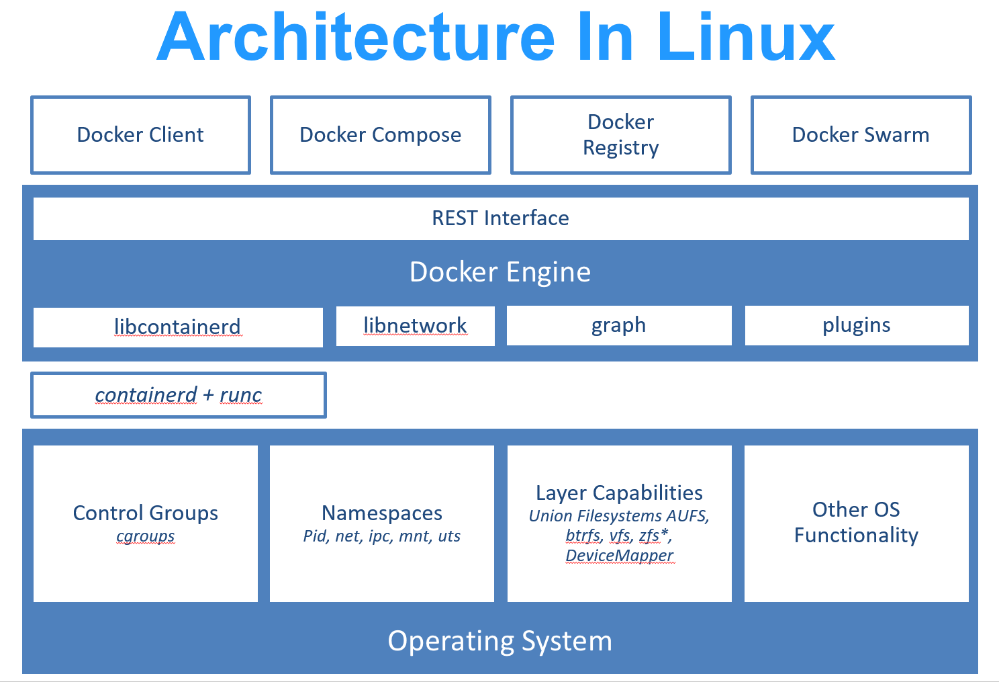

docker是一种虚拟化技术，将其简单当成虚拟机来用。

# docker介绍

docker有几个产品：
- docker engine：docker的核心部件，用于虚拟化
- docker build：一个根据dockerfile生成可运行的镜像的工具
- docker compose：用于管理多个镜像，如 oracle数据库镜像和java镜像，使用docker compose将两个整合起来运行。

docker的架构为：


虚拟机在宿主机上运行一个完成的虚拟操作系统，而docker则是直接使用宿主机的操作系统内核，也没有进行硬件虚拟，较虚拟机更高效。

镜像没有系统内核，但是镜像是一个特殊的文件系统，提供容器运行时所需的程序、库、资源和配置参数等（如环境变量）。

# 管理镜像

### 拉取镜像

从仓库拉取镜像的命令为：
``` bash
docker pull [选项] [Docker Registry 地址[:端口号]/]仓库名[:标签]
```

- Docker 镜像仓库地址：地址的格式一般是 <域名/IP>[:端口号]。默认地址是 Docker Hub(docker.io)。
- 仓库名：两段式名称，即 <用户名>/<软件名>。对于 Docker Hub，如果不给出用户名，则默认为 library，也就是官方镜像

如`docker pull ubuntu:18.04`命令的完整形式其实就是：`docker pull docker.io/library/ubuntu:18.04`


如果是私有的仓库，那么拉取前还需要登录。这时需要使用`docker login`命令，基本命令形式为：

``` bash
# 语法
docker login [OPTIONS] [SERVER]

Options:
  -p, --password string   Password 密码
      --password-stdin    Take the password from stdin 标准输出
  -u, --username string   Username 用户名
```

同样，`Server`的默认值仍然是`docker hub（docker.io）`

### 查看镜像

通过`docker image`命令可以可以管理下载下来的镜像，常见的操作包括镜像查看和删除等。

``` bash
Usage:  docker image ls [OPTIONS] [REPOSITORY[:TAG]]

List images

Aliases:
  docker image ls, docker image list, docker images

Options:
  -a, --all             Show all images (default hides intermediate images)
      --digests         Show digests
  -f, --filter filter   Filter output based on conditions provided
      --format string   Format output using a custom template:
                        'table':            Print output in table format
                        with column headers (default)
                        'table TEMPLATE':   Print output in table format
                        using the given Go template
                        'json':             Print in JSON format
                        'TEMPLATE':         Print output using the given
                        Go template.
                        Refer to https://docs.docker.com/go/formatting/
                        for more information about formatting output with
                        templates
      --no-trunc        Don't truncate output
  -q, --quiet           Only show image IDs
      --tree            List multi-platform images as a tree (EXPERIMENTAL)
```

使用`docker system df`命令可以查看各个容器的占用大小。


# 运行镜像

## 容器运行的基本命令
### 创建容器--`docker run`

通过`docker run`命令可以以镜像为基础启动并运行一个容器。
命令用法为：
``` bash
Usage:  docker run [OPTIONS] IMAGE [COMMAND] [ARG...]
Create and run a new container from an image

Aliases:
  docker container run, docker run
```

`[COMMAND]`是容器的**启动命令**，容器在创建后启动时执行该命令。
- 如果命令执行完可以返回，则容器将自动终止
- 如果命令可以挂起（如终端和一个服务），则容器会一直运行

以`ubuntu18.4`为例，运行改系统的命令为：
``` bash
docker run -it --rm ubuntu:18.04 bash
```
- `-i`：交互式运行
- `-t`：代表`tty（teletype）`，意味着打字机，后用来表示终端。这里表示分配一个伪终端。
- `-d`:代表`detach`,意味着容器可以在后台以守护态运行.但是容器是否是长期运行与`d`无关
- `-p`：将容器的端口映射到宿主机上
- `--rm`：退出容器后将容器自动删除，也可以手动使用`docker rm`命删除容器
- `--name=“XX”`:为容器创建一个名称
- `--network=XX`:配置容器的网络连接方式
- `ubuntu：18.4`： 以`ubuntu18.4`镜像为基础运行该容器
- `bash`：因为使用的是交互式启动运行，因此使用`bash`这一个交互式`shell`

再如：`docker run ubuntu:18.04 /bin/echo 'Hello world'`命令就是调用`/bin/echo`命令输出`hello world`

因为没有使用`-i`选项，所以没有交互，跟直接在终端中输入`echo 'hello world'`没啥区别


### 容器访问--`docker exec/attach`
#### `docker exec`

使用`docker exec`命令可以进入正在后台运行的容器。其命令的基本用法和`docker run`的相似。但是`docker run`是创建一个容器，而`docker exec`只是进入`docker run`已经创建好的容器

#### `docker attach`
此命令和`detach`是相反的，使用`docker run -d`命令后容器与终端分离，终端退出后容器也能继续运行。

但是`docker attach`命令不同，其`docker`容器的生命周期和终端是相互绑定的。


## 容器运行的过程

当利用` docker run` 来创建容器时，`Docker`在后台运行的标准操作包括：
1. 检查本地是否存在指定的镜像，不存在就从`registry（源）`下载
2. 利用镜像**创建**并启动一个容器
1. 分配一个文件系统，并在只读的镜像层外面挂载一层可读写层
1. 从宿主主机配置的网桥接口中桥接一个虚拟接口到容器中去
  1. 从地址池配置一个 ip 地址给容器
1. 执行用户指定的启动命令（但是容器在构建的时候一般就会有默认的启动命令）
2. 执行完毕后容器被终止


因此在实际上，很多东西在创建时就指定了，在容器运行时是不可修改的。如网络配置和文件挂载等。

# Ref

1. [docker:login和logout登录与登出](https://www.cnblogs.com/hider/p/17043224.html)
2. [获取镜像](https://yeasy.gitbook.io/docker_practice/image/pull)
3. [操作容器](https://yeasy.gitbook.io/docker_practice/container)
4. [数据管理：数据卷和挂载主机目录](https://yeasy.gitbook.io/docker_practice/data_management)